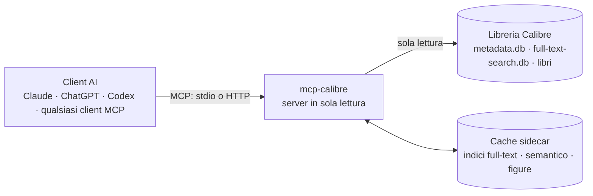
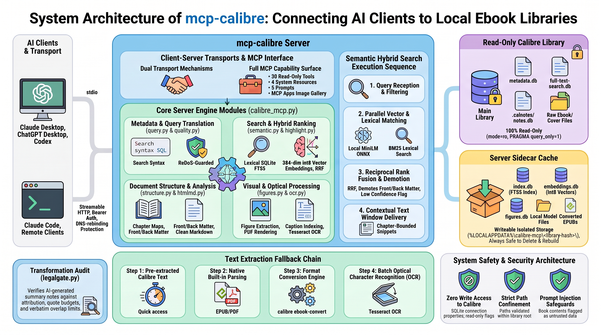

<p align="center"></p>

# mcp-calibre

[🇬🇧 English](README.md) · 🇮🇹 Italiano

[](https://m8ven.ai/mcp/jumpifequal/mcp-calibre?s=readme)

**La tua libreria Calibre, leggibile dal tuo assistente AI: privata, in sola lettura, veloce.**

mcp-calibre è un server [MCP](https://modelcontextprotocol.io) che permette a Claude, ChatGPT, Codex e a qualsiasi
altro client MCP di cercare, leggere e comprendere i libri della tua libreria [Calibre](https://calibre-ebook.com)
locale. Legge direttamente i database di Calibre (nessun processo Calibre necessario, mai alcun accesso in
scrittura) e aggiunge ciò che serve a un assistente per lavorare davvero con una libreria: ricerca full-text,
ricerca per significato, lettura per capitoli, immagini, OCR dei PDF scansionati, pulizia della libreria e una
verifica che gli appunti scritti a partire dai libri non li copino.

[Installalo](docs/it/installation.md) · [Personalizzalo e scopri come funziona](docs/it/tweaking.md) · [Skill](docs/it/skills.md) · [FAQ](docs/it/faq.md) · [Prestazioni](docs/it/performance.md)

## Perché ti piacerà

- **Privato e in sola lettura.** Tutto gira sul tuo computer. I database di Calibre vengono aperti in sola lettura,
  non ci sono tool di scrittura né shell: il server non può modificare la tua libreria. Al tuo client AI arriva
  solo ciò che un tool restituisce.
- **Tre modi di cercare.** Per metadati, con la sintassi di ricerca di Calibre; per parole esatte, con una ricerca
  full-text ordinata per rilevanza; e per significato, con la ricerca semantica multilingue (chiedi in italiano,
  trova passaggi in inglese).
- **Legge i libri come si deve.** Una mappa dei capitoli per ogni formato, LIT e MOBI compresi: leggi un capitolo,
  un intervallo di pagine o il passaggio attorno a un risultato di ricerca.
- **Mostra le immagini nella chat.** Copertine e figure compaiono inline, con i pulsanti Copia e Salva PNG, senza
  consumare token del modello.
- **Capisce i PDF scansionati.** L'OCR con Tesseract li trasforma in testo ricercabile e leggibile, con un comando
  batch che non rallenta mai una conversazione.
- **Mette ordine nella libreria.** Un report sulla qualità dei metadati, i duplicati confrontati campo per campo,
  gli ISBN trovati nel testo.
- **Trasforma i libri in skill e in agenti.** Quattro skill companion in `skills/` vanno ben oltre la ricerca.
  `calibre-distill` distilla un libro in una tua skill riutilizzabile (framework, guida alle decisioni, glossario,
  checklist). `calibre-distill-topic` sintetizza un argomento attraverso tre o più libri e mostra dove le fonti
  concordano e dove no. `calibre-book-agent` trasforma un libro in un agente che ne applica l'approccio e verifica il
  libro prima di dire cosa sostiene. `calibre-book-redteam` mette alla prova le affermazioni di un libro contro il
  resto della tua libreria. Tutte e quattro finiscono con un legal gate che verifica che gli appunti non copino i libri. Il
  [manuale delle skill](docs/it/skills.md) le spiega una per una.
- **Veloce.** Le ricerche rispondono in millisecondi su una libreria di 1.500 libri (numeri
  [qui sotto](#prestazioni-in-breve)).

## Cosa puoi chiedere

| Obiettivo | Esempio di richiesta | Tool coinvolti |
|---|---|---|
| Trovare libri | "i miei libri di sicurezza non letti pubblicati dopo il 2020" | `calibre_search_books` (`query: 'tag:security and not #letto:true and pubdate:>2020'`) |
| Trovare dove se ne parla | "quali libri spiegano la prompt injection?" | `calibre_search_fulltext`, `calibre_search_semantic` |
| Leggere | "leggi il capitolo 3 di 1168", "mostrami l'indice" | `calibre_get_chapters`, `calibre_read_text(chapter=…)`, `calibre_read_section` |
| Vedere immagini | "mostrami le copertine di 1168 e 1164", "trova un diagramma del ciclo dell'agente" | `calibre_show_images`, `calibre_search_figures`, `calibre_list_figures` |
| Riordinare la libreria | "cosa c'è che non va nei miei metadati?", "523 e 906 sono lo stesso libro?" | `calibre_quality_report`, `calibre_find_duplicates`, `calibre_compare_books`, `calibre_find_isbn` |
| Imparare dai libri | "distilla 1168 in una skill", "sintetizza l'affidabilità degli agenti da 1164, 1168 e 1162" | skill `calibre-distill` / `calibre-distill-topic`, `calibre_check_overlap` |
| Applicare il metodo di un libro | "trasforma il metodo di 1168, un libro di management, in una skill da usare con il mio team" | skill `calibre-distill`, `calibre_check_overlap` |
| Far lavorare due libri | "trasforma 1168 e 1164 in due agenti e lasciali discutere (o collaborare) su come salvare un progetto in ritardo" | due agenti `calibre-book-agent` ([come](docs/it/skills.md#libro-contro-libro-ricetta-passo-per-passo)) |
| Mettere alla prova un libro | "1168 regge? verifica le sue affermazioni contro il resto della mia libreria" | skill `calibre-book-redteam`, `calibre_search_semantic` |

In tutto: **30 tool**, 4 resource e 5 prompt, tutti in sola lettura. L'elenco completo è nel
[riferimento dei tool](docs/it/tweaking.md#tool).

## I libri che lavorano per te

Cercare è solo l'inizio. Quattro skill pronte in `skills/` mettono al lavoro i tuoi libri:

- **Trasforma un libro in un metodo.** Passa un libro di management, negoziazione o ingegneria e ottieni una skill che
  il tuo assistente applica alla tua situazione, scritta con parole sue e verificata perché non copi il libro.
- **Dai una voce a un libro.** Crea un agente che ragiona come un libro, verifica il libro prima di dire cosa sostiene,
  cita il capitolo e ammette "il libro non ne parla" quando è così.
- **Fai discutere due libri.** Metti due di questi agenti sullo stesso problema e lasciali dibattere, oppure costruire
  insieme un piano: ognuno difende il suo libro, concede dove l'altro è più forte e dice cosa gli farebbe cambiare
  idea. Lo scambio lo imposti tu; il manuale ha la ricetta.
- **Scopri se un libro regge.** Le sue affermazioni centrali vengono confrontate con il resto della tua libreria,
  prima la migliore difesa del libro, e ottieni un verdetto per ogni affermazione: sostenuta, precisata, contestata o
  contraddetta, e da quali dei tuoi libri.
- **Mappa un intero scaffale.** Chiedi cosa dicono cinque libri su un argomento e ottieni una guida organizzata per
  concetti che mostra dove concordano, dove si completano e dove divergono.

Ogni risultato termina con un legal gate che verifica che sia una trasformazione e non una copia dei libri.

**[Come funzionano le skill, con esempi e una ricetta passo per passo per libro contro libro](docs/it/skills.md)**

## Come funziona



1. **Il client parla MCP con il server.** Via stdio (Claude Desktop, app desktop ChatGPT, Codex) oppure via
   Streamable HTTP (Claude Code, altri client, un server condiviso).
2. **Il server legge direttamente i database di Calibre,** in sola lettura: nessun processo `calibredb` da avviare,
   query in millisecondi, e funziona anche con Calibre aperto.
3. **Una piccola cache sidecar rende ricercabile il contenuto.** Calibre conserva il testo estratto dei libri ma con
   un tokenizer che altri programmi non possono interrogare, quindi il server mantiene un proprio indice full-text,
   aggiornato in modo incrementale. Gli indici opzionali semantico e delle figure stanno accanto. La cache è l'unica
   cosa che il server scrive, e si può sempre cancellare senza rischi.
4. **I libri si leggono a richiesta.** Prima il testo di Calibre, poi un parser EPUB integrato, PyMuPDF per i PDF e
   `ebook-convert` di Calibre per LIT, MOBI e il resto. I PDF scansionati vengono sottoposti a OCR in un passo batch.



*Panoramica visiva del nucleo del server (accesso in sola lettura, indice full-text sidecar, catena di estrazione,
trasporti). Il riferimento preciso e aggiornato è [Sotto il cofano](docs/it/tweaking.md#architettura), compresi gli indici semantico e delle
figure introdotti nella 5.0.*

## Prestazioni in breve

Misurate su una libreria **sintetica** di 1.500 libri (524 MB di testo) su un solo core di CPU (2,1 GHz Intel Xeon), con il
benchmark incluso nel repository (`tests/bench_synthetic.py`):

| Operazione | Tempo tipico |
|---|---|
| Costruzione iniziale dell'indice, una tantum | 21 s (148 MB di indice) |
| Sincronizzazione incrementale dopo una modifica | 0,15 s |
| Ricerca nei metadati | 3,2–7,8 ms |
| Ricerca full-text, 10 libri × 3 snippet | 25–63 ms |
| Ricerca full-text, 50 libri, senza snippet | 2,5–3,0 ms |
| Leggere una finestra di 6.000 caratteri / cercare in un libro | 1,9 ms / 8,3 ms |
| Mappa dei capitoli di un libro | 1,9 ms |
| Ricerca semantica ibrida su 60.376 passaggi* | 75 ms |

\* misurata con il backend di embedding offline `hash`: mette alla prova indice e ranking, non la velocità del modello reale.

Questi valori mostrano come scala il server, non cosa farà la tua libreria reale: le librerie vere hanno PDF, file
LIT e MOBI e dischi più lenti. Metodo, risultati completi, dimensionamento dell'indice semantico e messa a punto
sono nel [manuale delle prestazioni](docs/it/performance.md).

## Avvio rapido

Servono Windows 10/11, [Python](https://www.python.org) 3.10 o successivo (64 bit) e Calibre con l'indicizzazione
full-text attiva. Poi, con la procedura guidata grafica:

```powershell
git clone https://github.com/jumpifequal/mcp-calibre C:\Tools\mcp-calibre
C:\Tools\mcp-calibre\setup-wizard.bat
```

oppure con un solo comando:

```powershell
cd C:\Tools\mcp-calibre
powershell -ExecutionPolicy Bypass -File .\install.ps1 -Library "D:\Books\Calibre Library" -Pdf pymupdf -Register
```

Riavvia completamente Claude Desktop (esci dall'icona nella tray): avvia il server da solo, non c'è altro da
lanciare. Poi chiedi: *"quali libri della mia libreria
spiegano la prompt injection?"* Il [manuale di installazione](docs/it/installation.md) descrive le tre strade
(procedura guidata, script, manuale), gli altri client e come verificare che tutto funzioni.

## Funziona con

| Client | Connessione | Configurazione |
|---|---|---|
| Claude Desktop | stdio | [Installazione](docs/it/installation.md#collega-il-tuo-client-ai) |
| Claude Code | Streamable HTTP | [Trasporto HTTP](docs/it/installation.md#trasporto-http) |
| App desktop ChatGPT, Codex CLI, estensione IDE di Codex | stdio (oppure HTTP) | [Client OpenAI](docs/it/installation.md#client-openai-app-desktop-chatgpt-codex-cli-estensione-ide-di-codex) |
| Qualsiasi altro client MCP | stdio o HTTP | [Installazione](docs/it/installation.md#collega-il-tuo-client-ai) |

ChatGPT sul web e i connettori personalizzati di claude.ai non possono usarlo: raggiungono solo endpoint HTTPS
pubblici con OAuth, e non è un modo supportato per esporre una libreria personale.

## Documentazione

| Manuale | Leggilo per |
|---|---|
| [Installazione](docs/it/installation.md) | installare con la procedura guidata, lo script o a mano; collegare Claude, Codex e ChatGPT; verificare, aggiornare, disinstallare |
| [Personalizzazione e funzionamento interno](docs/it/tweaking.md) | capire architettura e archivi di dati, tool e funzioni in dettaglio, ogni impostazione e flag da riga di comando, la console, la sicurezza |
| [Skill](docs/it/skills.md) | usare le quattro skill companion: distillare un libro, sintetizzare un argomento, trasformare un libro in agente, mettere alla prova un libro; il legal gate; come far confrontare due libri |
| [FAQ e risoluzione dei problemi](docs/it/faq.md) | risolvere i problemi di installazione e di uso, e conoscere i limiti |
| [Prestazioni](docs/it/performance.md) | vedere come è stata misurata la velocità, i risultati, il dimensionamento e la messa a punto |

## Sicurezza in breve

- Sola lettura per costruzione: connessioni SQLite in `mode=ro`, nessun tool di scrittura, nessuna shell; le uniche
  scritture sono nella cache del server.
- L'HTTP richiede un bearer token (bind su loopback di default); `--no-auth` è rifiutato ovunque tranne che su
  loopback.
- Testo dei libri, annotazioni e testo nelle immagini sono contenuti di terzi: il server dice al modello di non
  seguire mai le istruzioni che vi trova, ma evita di combinarlo nella stessa sessione con tool ad alto impatto
  (invio di email, shell, browser).
- L'elenco completo è nelle [Note di sicurezza](docs/it/tweaking.md#note-di-sicurezza).
- Un indice di fiducia indipendente, M8ven, analizza il codice: il badge in alto mostra il punteggio attuale. I progetti nuovi non superano il grado C finché non ottengono adozione.

## Background

L'idea di esporre una libreria Calibre via MCP è stata esplorata per la prima volta dal progetto in bash
[trieloff/calibre-mcp](https://github.com/trieloff/calibre-mcp). Questo progetto è un'implementazione
indipendente e non ne condivide il codice.

## Licenza

Apache-2.0.
