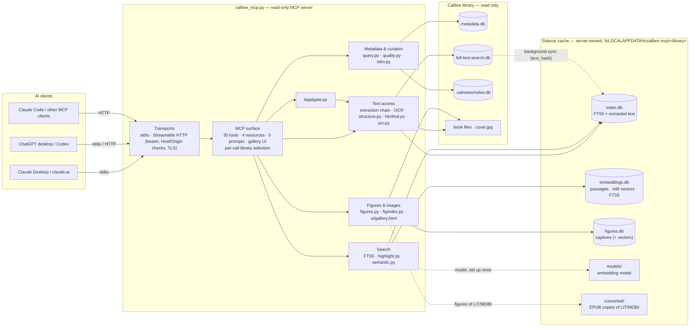
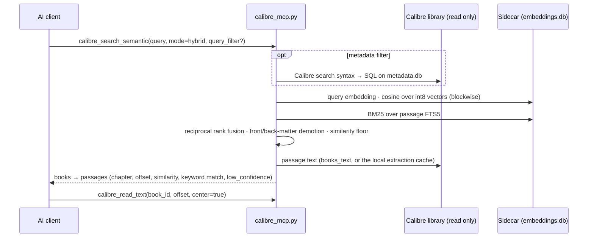

# Tweaking and under the hood

[← README](../../README.md) · [Installation](installation.md) · **Tweaking and under the hood** · [Skills](skills.md) · [FAQ and troubleshooting](faq.md) · [Performance](performance.md)

🇬🇧 English · [🇮🇹 Italiano](../it/tweaking.md)

How mcp-calibre works inside, what each feature does in depth, and every setting you can change. Read it to
understand a behaviour, to tune the server, or to find the exact name of a tool, variable or command-line flag.
New here? Start with the [README](../../README.md); to install, see the [installation manual](installation.md). The skills
(distill, book agent, red-team) and the legal gate have their own manual: [Skills](skills.md).

**Contents**

- **How it works**: [Architecture](#architecture) · [Design](#design) · [Why a sidecar index](#why-a-sidecar-index) · [Text extraction chain](#text-extraction-chain)
- **Features in depth**: [Tools](#tools) · [Library curation](#library-curation) · [Reading by chapter](#reading-by-chapter) · [OCR for scanned PDFs](#ocr-for-scanned-pdfs) · [Optional features](#optional-features) · [Semantic search model](#semantic-search-model) · [Showing images in the chat](#showing-images-in-the-chat)
- **Configuration**: [Environment variables](#environment-variables) · [Command line](#command-line) · [Console (graphical manager)](#console-graphical-manager)
- **Security and layout**: [Security notes](#security-notes) · [Repository layout](#repository-layout)

## Architecture

### Components



Every arrow into the Calibre library is a read through a SQLite connection opened in `mode=ro` with
`PRAGMA query_only=1`, or a read of a book file inside the library root. The server writes only to its own
sidecar cache.

### Modules

| Module | Responsibility |
|---|---|
| `calibre_mcp.py` | Entry point and CLI; stdio/HTTP transports; tool, resource and prompt registration; multi-library registry; the text extraction chain; the sidecar full-text index (`index.db`) and its background sync |
| `mcpcalibre/query.py` | Calibre search syntax → parametrised SQL (boolean logic, exact/regex, numbers, dates, custom columns, `vl:` and `search:`), with a ReDoS guard |
| `mcpcalibre/quality.py` | Metadata audit (per-book and library-wide checks) |
| `mcpcalibre/isbn.py` | ISBN-10/13 validation and discovery in book text |
| `mcpcalibre/structure.py` | Chapter map: TOC alignment or heading detection, front/back matter classification |
| `mcpcalibre/htmlmd.py` | EPUB HTML → Markdown (headings, lists, tables, code, figure ids) |
| `mcpcalibre/highlight.py` | Query-aware snippets: FTS5 clauses (phrases, `NEAR`, `NOT`) located in the text, best windows first |
| `mcpcalibre/semantic.py` | Embedding backends, chapter-bounded contextual passages, int8 vector store, hybrid search with RRF |
| `mcpcalibre/figures.py` | Figure listing/extraction for EPUB and PDF, page rendering, safe image decoding |
| `mcpcalibre/figindex.py` | Library-wide caption index for figure search |
| `mcpcalibre/ocr.py` | Tesseract OCR: page selection, language choice, language-file download |
| `mcpcalibre/legalgate.py` | Overlap, quote, compression, heading and attribution checks for derived notes |
| `mcpcalibre/ui/gallery.html` | MCP Apps view: inline image gallery with Copy/Save PNG |

### Data stores

| Store | Where | Who writes it | Contents | How it is (re)built |
|---|---|---|---|---|
| `metadata.db` | Calibre library | Calibre only | books, authors, tags, series, custom columns, identifiers, annotations, preferences | — (read only) |
| `full-text-search.db` | Calibre library | Calibre only | text extracted by Calibre from every format | Calibre's FT indexing |
| `.calnotes/notes.db` | Calibre library | Calibre only | notes on authors, tags, series (Calibre 7+) | — (read only) |
| `index.db` | sidecar | this server | FTS5 index of Calibre's text, text extracted on demand, optional stemmed index | automatic: background sync at startup and every 10 min; `--sync` |
| `embeddings.db` | sidecar | this server | passages (offset, chapter, kind), int8 vectors, passage FTS5 | `--build-embeddings` (incremental; `--rebuild`) |
| `figures.db` | sidecar | this server | figure captions and alt text, optional caption vectors | `--index-figures` (incremental) |
| `models/` | sidecar root | this server | embedding model cache | `--download-model` (setup) |
| `tessdata/` | sidecar root | this server | Tesseract language files | `install.ps1` / `--download-ocr-langs` |
| `converted/` | sidecar | this server | EPUB copies of LIT/MOBI/AZW3 books, made to reach their figures | on demand, by file stamp |

The sidecar lives in `%LOCALAPPDATA%\calibre-mcp\<library-hash>\` (one folder per library). Deleting it is
always safe: everything in it can be rebuilt from the Calibre library.

### Request flow: a semantic question



### Read-only guarantees

| Reads | Writes |
|---|---|
| Calibre databases through `mode=ro` + `PRAGMA query_only=1`; book files and covers inside the library root (paths resolved and confined) | only the sidecar cache above, and the log file |

There are no write tools, no shell, and no network access at query time (the model is downloaded once during
setup). The only subprocess is Calibre's `ebook-convert`, run without a shell, with a timeout and at
below-normal priority.

## Design

| Aspect | Choice |
|---|---|
| Data access | direct SQLite on `metadata.db` / `full-text-search.db` in `mode=ro`: no `calibredb` subprocesses, millisecond queries |
| Calibre GUI open | supported: read-only connections never conflict with Calibre's locks |
| Full-text | sidecar FTS5 index over the text **Calibre has already extracted** (EPUB/PDF/MOBI/DOCX…) |
| Readable formats | Calibre FTS text, then on-demand extraction: EPUB (built-in), PDF (PyMuPDF/pypdf), everything else via `ebook-convert` |
| Transports | stdio and Streamable HTTP (stateless, JSON responses, bearer auth, DNS-rebinding protection, optional TLS) |
| Portability | Windows/macOS/Linux, library auto-detection |
| Logging | stderr + `%LOCALAPPDATA%\calibre-mcp\calibre-mcp.log`, queries logged only at DEBUG |
| Semantic search | opt-in local index of chapter-bounded, contextual passages (int8 vectors + passage FTS5), hybrid ranking with reciprocal rank fusion |
| Structure | chapter map for every format (TOC alignment or heading detection), front/back matter classified |
| Images | covers and figures decoded safely and shown inline through an MCP Apps view; image data never enters the model context |
| Curation | read-only audits: quality report, duplicates and comparison, ISBN discovery |
| Derived notes | companion skills plus a mechanical legal gate (overlap, quotes, compression, headings, attribution) |

## Why a sidecar index

Calibre's FTS5 table uses a custom tokenizer (`calibre`) implemented in Calibre's C extension, so stock SQLite
cannot run `MATCH` against it. The plain-text `books_text` table, however, is readable. The server therefore:

1. reads `books_text` read-only;
2. maintains an FTS5 index (`unicode61 remove_diacritics 2`) in `%LOCALAPPDATA%\calibre-mcp\<library-hash>\index.db`;
3. syncs it **incrementally** by `text_hash` (background thread at startup, then every 10 minutes).

With SQLite ≥ 3.43 (Python 3.12+ from python.org) the index is *contentless* (`contentless_delete=1`) and does
not duplicate the text. With older SQLite it falls back to standard FTS5 (roughly the size of the text).

How fast this is, measured on a synthetic library of 1,500 books, is in the [performance manual](performance.md#results).

## Text extraction chain

For each book, in order:

1. Calibre's FTS text (already extracted by Calibre, fastest);
2. local cache;
3. on-demand extraction:
   - EPUB: built-in parser, tolerant of broken container/OPF/spine/TOC (problems become `warnings`);
   - PDF: PyMuPDF or pypdf, no page limit;
   - TXT: read directly;
   - anything else (LIT, MOBI, AZW3, RTF, DOC, ODT…): Calibre's `ebook-convert`;
4. OCR, for scanned PDFs, in the batch command `--extract-missing` only (see [OCR for scanned PDFs](#ocr-for-scanned-pdfs)).

If one format fails, the next one is tried. Extracted text is cached **and indexed**, so a book read once also
becomes findable through `calibre_search_fulltext`. Scanned PDFs without a text layer return an explicit
"OCR needed" error.

## Tools

All tools are read-only and accept an optional `library` argument when several libraries are configured.

| Tool | Purpose |
|---|---|
| `calibre_search_books` | Metadata search: structured filters plus **Calibre search syntax** in `query`, `virtual_library`, sorting (title, author, added, published, modified, rating, series), pagination |
| `calibre_search_fulltext` | Content search, BM25, accent-insensitive. Modes `all`/`any`/`phrase`/`raw` (FTS5). `query_filter` / `virtual_library` restrict candidates; `stemmed=true` matches word variants. Snippets are the passages covering the most specific matched clauses (phrases, `NEAR` groups; `NOT` terms excluded) and list them in `matched` |
| `calibre_search_semantic` | Meaning-based passage search (opt-in embedding index). Multilingual; `alt_queries` adds paraphrases or translations, fused per passage |
| `calibre_get_book` | Full metadata, custom columns, reading progress, notes on its authors/series/tags, formats, text availability |
| `calibre_read_text` | Text window by offset (optionally centred on a snippet offset) |
| `calibre_find_in_book` | Keyword-in-context search inside one book, paginated |
| `calibre_get_toc` | EPUB TOC (nav/NCX → section indices) or PDF outline + page count |
| `calibre_read_section` | One EPUB chapter or a PDF page range; `output="markdown"` keeps headings, lists, tables, code; image placeholders carry figure ids (`[image s3-2: alt]`) |
| `calibre_show_images` | **Shows** covers and figures to the user inline in the chat (MCP Apps gallery), with Copy PNG / Save PNG buttons; image data never enters the model's context |
| `calibre_list_figures` | Figures of a book as a cheap text list: id, caption or alt text, chapter or page, size. EPUB, PDF, and other formats via a cached EPUB conversion |
| `calibre_get_figure` | One figure as an image, resized; SVG rasterised |
| `calibre_render_page` | A PDF page, or an area of it, as an image: for diagrams drawn as vectors, tables, formulas |
| `calibre_get_chapters` | Chapter map for any format (LIT, MOBI, PDF without outline included): from the book's own TOC when possible, else from headings in the text; each chapter is body, front or back matter |
| `calibre_quality_report` | Metadata audit: missing fields, file-name titles, invalid ISBNs, author name anomalies, unsorted author sort, same author or tag written differently, series gaps |
| `calibre_find_isbn` | Finds the book's ISBN in its own text (copyright page first), checksum-validated, compared with the stored one |
| `calibre_compare_books` | Field-by-field comparison of possible duplicates, with a suggestion of which record to keep; flags translations |
| `calibre_semantic_index_report` | Sanity check of the semantic index: failed (with the error), missing, stale, empty, sparse, capped, no-text and orphan books, plus database integrity; each with its fix |
| `calibre_search_figures` | Finds figures across the library by caption and alt text (keyword, plus meaning with the semantic model) |
| `calibre_check_overlap` | Legal gate: checks that notes derived from books do not reproduce them (verbatim overlap, quotes, compression, heading mirroring, attribution) |
| `calibre_list_facets` | Authors/tags/series/publishers/languages/formats with book counts |
| `calibre_list_custom_columns` | Your `#columns`: type, multiplicity, coverage, top values |
| `calibre_list_virtual_libraries` | Virtual libraries and saved searches with expression and book count |
| `calibre_reading_progress` | Last read positions from the Calibre viewer: reading / finished |
| `calibre_get_annotations` | Highlights, notes and bookmarks from the Calibre viewer |
| `calibre_get_notes` | Calibre 7+ notes on authors, tags, series, publishers |
| `calibre_get_cover` | Cover image, resized |
| `calibre_similar_books` | Similar books: by metadata (rare tags weigh more), by content (distinctive words of the book matched on the full-text index, used automatically when metadata is too sparse), or by embeddings |
| `calibre_find_duplicates` | Probable duplicates by title, title+author or ISBN. Strict by default: ignores edition notes and digit-free bracketed remarks, keeps subtitles and numbered parts, never groups different numbers of one series. `loose=true` also ignores subtitles |
| `calibre_list_libraries` | Configured libraries |
| `calibre_library_status` | Diagnostics: FTS coverage, sidecar and stemmed index, semantic index, enabled features |

### Calibre search syntax (`query`)

| Example | Meaning |
|---|---|
| `kerberos` / `"lateral movement"` | Title, authors, tags, series, publisher, comments |
| `tag:security and not tag:malware` | Boolean `and` / `or` / `not`, parentheses, implicit AND |
| `author:"=Bruce Schneier"` · `title:"~^Practical"` | Exact match · regular expression |
| `rating:>=4` · `#pages:>500` | Numeric comparisons (ratings in stars) |
| `pubdate:>2020` · `date:<2024-03` · `date:>30daysago` | Dates: YYYY, YYYY-MM, YYYY-MM-DD, today, yesterday, thismonth, thisyear, Ndaysago |
| `formats:pdf` · `languages:ita` · `cover:false` · `size:>20M` | Formats, languages, cover, largest file size |
| `identifiers:isbn:true` · `isbn:9781593272906` | Identifiers |
| `#genre:"=netsec"` · `#course:sans` · `#pages:>300` | Custom columns (text, enumeration, series, comments, int, float, rating, bool, datetime), discovered at runtime from each library. Lookup name as in Calibre; the visible heading also works (`#mustread` for "Must Read") |
| `#mustread:yes` · `:no` · `:true` · `:false` | Yes/no columns follow Calibre exactly. Default (tristate): `yes`/`checked` = Yes, `no`/`unchecked` = No, `true` = Yes or No (set), `false`/`empty`/`blank` = unset. With Calibre's two-state setting: `true`/`yes` = Yes, `false`/`no` = No or unset |
| `vl:"Unread security"` · `search:"Big books"` | Virtual libraries and saved searches, expanded recursively with cycle detection |

Not supported: `template:`, `marked:`, `ondevice:`, composite (computed) columns. All values are bound as SQL
parameters. Regular expressions are capped in length and patterns with nested quantifiers or backreferences
are rejected (Python `re` has no timeout).

### Resources and prompts

| Resource | Content |
|---|---|
| `calibre-mcp://book/{id}` | Book card in Markdown: metadata, custom columns, progress, description, table of contents |
| `calibre-mcp://book/{id}/section/{n}` | One EPUB chapter as Markdown |
| `calibre-mcp://book/{id}/highlights` | Viewer highlights and notes as Markdown |

Prompts: `summarize_book`, `research_topic`, `compare_books`, `export_highlights`, `reading_status`.
Resources address the default library. The scheme is `calibre-mcp://`, not `calibre://`, which belongs to
Calibre's own desktop links.

## Library curation

All curation tools are read-only: they report, and you fix in Calibre. None of them needs an index.

### Quality report

`calibre_quality_report` audits the whole library, a Calibre query (`query: 'tag:security'`) or a virtual
library. It returns a summary per check, a paginated list of book issues, and library-wide issues.

| Check | What it finds | Typical fix in Calibre |
|---|---|---|
| `missing_authors`, `missing_tags`, `missing_language`, `missing_publisher`, `missing_pubdate`, `missing_cover`, `missing_isbn`, `missing_description` | the field is empty (or the author is "Unknown") | Edit metadata, or Download metadata |
| `no_formats` | a record without any book file | delete the record or add the file |
| `raw_filename_title` | titles like `795731065.pdf` or `BOOK_12_final` | Edit metadata → title (or `calibre_find_isbn` + Download metadata) |
| `title_noise` | `(Italian Edition)`, `[ebook]`, double or trailing spaces | Edit metadata → title |
| `invalid_isbn` | a stored ISBN with a wrong checksum or length | fix the identifier (`calibre_find_isbn` finds the right one) |
| `author_name_anomaly` | `\|`, `;`, digits, `Surname, Name` in the name field, all caps | Manage authors → rename |
| `author_sort_unsorted` | author sort equal to the name (`Glenn Cooper` instead of `Cooper, Glenn`) | Manage authors → recalculate author sort |
| `author_variants` | the same author written differently (`Cooper\| Glenn` and `Glenn Cooper`) | Manage authors → rename one into the other (Calibre merges them) |
| `tag_variants` | the same tag written differently (`Science-Fiction`, `science fiction`) | Tag browser → rename (merges) |
| `series_gaps` | missing or duplicated numbers in a series | fix the series index, or note the missing volume |

### Duplicates and comparison

`calibre_find_duplicates` groups probable duplicates by title, title + author, or ISBN. It is strict by default:
edition notes and bracketed remarks without numbers are ignored, but subtitles and numbered parts are kept, and
different numbers of one series are never grouped. Groups whose books are in different languages are flagged as
**likely translations**. `calibre_compare_books` then compares a group field by field (formats, identifiers,
description, cover, extracted text…) and suggests which record to keep.

### ISBN from the text

`calibre_find_isbn` scans the book's own text (copyright page first; ISBNs cited in the body rank lower), keeps
only checksum-valid ISBNs, and compares the best one with the stored identifier: confirmed, different, or
suggested. Useful for books with poor metadata before "Download metadata".

## Reading by chapter

`calibre_get_chapters` returns a chapter map for **every** format:

| Method | When | How |
|---|---|---|
| `toc` | EPUB with a TOC, PDF with an outline | the book's own TOC entries are located in the text, in order (numbering such as "1." or "Chapter 3" is ignored on both sides) |
| `headings` | LIT, MOBI, AZW3, DOCX, PDFs without outline, EPUBs without TOC | headings are detected in the text (chapter/part keywords in several languages, numbering, roman numerals, short all-caps lines); a table of contents printed in the text is recognised and skipped |
| `none` | no structure found | one chapter covering the whole text |

Each chapter is classified as `body`, `front` (contents, copyright, praise, dedication…) or `back` (index,
bibliography, notes…), using its title and, for ambiguous titles such as acknowledgments, its position.
`calibre_read_text(book_id, chapter=N)` reads one chapter and stops at its end. The same map drives semantic
passages (they never cross a chapter), front-matter demotion, and the legal gate's heading check.
`calibre_get_toc` / `calibre_read_section` remain available for EPUB sections and PDF page ranges.

## OCR for scanned PDFs

Scanned PDFs have no text layer, so Calibre cannot index them and they stay invisible to search. With an OCR
engine installed, `--extract-missing` recognises them **automatically**: only the pages without text are
processed (pages with a text layer are kept as they are), and the result goes to the server's cache like any
other extraction. The PDF is never modified. After that, full-text search, chapters and (after
`--build-embeddings`) semantic search work on those books too.

```powershell
.\install.ps1                                                       # sets up OCR by default: Tesseract (winget) + ita/eng
.venv\Scripts\python.exe calibre_mcp.py --extract-missing            # OCRs scanned PDFs, remembers failures
.venv\Scripts\python.exe calibre_mcp.py --build-embeddings           # adds the new texts to semantic search
```

| Engine (`CALIBRE_MCP_OCR_ENGINE`) | Speed on CPU | Faithfulness | Notes |
|---|---|---|---|
| `tesseract` (default when installed) | ~1–3 s per page | high: it transcribes, never invents | language from the book's Calibre language, else `ita+eng`; language files downloaded by `install.ps1` into `%LOCALAPPDATA%\calibre-mcp\tessdata` |
| `none` | — | — | OCR disabled |

**PDFs with a bad text layer** (an old, garbled OCR) look indexed but read as nonsense. Re-OCR them explicitly; the
new text then takes precedence over Calibre's for reading, full-text and semantic search:

```powershell
.venv\Scripts\python.exe calibre_mcp.py --extract-missing --books 812,977 --force-ocr
```

OCR runs only in this batch command, never inside a chat request (a whole book takes minutes). Books that fail
are remembered and skipped until one of their files changes; `--retry-failed` tries them again. The semantic
index report shows their error under `no_text`.

## Optional features

**Several libraries.** Set `CALIBRE_LIBRARIES` to paths separated by `;` on Windows (`:` elsewhere); the first is
the default. Each library gets its own sidecar index.

**Stemmed search.** `CALIBRE_MCP_STEMMING=1` builds a second FTS5 index with the Porter stemmer
(`exploits` ↔ `exploitation`). It roughly doubles the index size and is filled incrementally in the background.
Porter is an **English** stemmer: it does not help with Italian text.

**Semantic search.** Dependencies and model are installed by `install.ps1` (skip with `-NoSemantic`): see
[Semantic search model](#semantic-search-model). The index is opt-in and never built automatically:

```powershell
.venv\Scripts\python.exe calibre_mcp.py --build-embeddings --max-books 50   # incremental, resumable
```

How the index is built: each book is split into passages of about 700 characters that never cross a chapter
boundary (chapter map), and each passage is embedded together with its context (title, author and chapter), so
the vector knows where it comes from. The whole book is covered, up to 1,500 passages (`CALIBRE_MCP_EMBED_MAX_CHUNKS`),
stored as int8 vectors plus a keyword index over the same passages.

How a query is answered (`mode`): **hybrid** (default) ranks passages by meaning and by exact terms (names, ids,
code) and fuses the two rankings with reciprocal rank fusion; `vector` and `keyword` use one half only. Front and
back matter (contents, praise, index) is demoted and labelled; matches below the similarity floor
(`CALIBRE_MCP_SEMANTIC_FLOOR`, default 0.30, not yet calibrated on large libraries) are flagged `low_confidence`.
With `book_id` the search returns ranked passages inside one book.

Sizing: about 700 passages per average book, ~384 bytes each in memory. For ~1,000 books expect ~300 MB of RAM
for the vectors, an index of ~600 MB on disk, and a first build of one to two hours of CPU (half the cores by
default, `CALIBRE_MCP_EMBED_THREADS`); later builds only process new or changed books.

**Upgrading from 4.x:** the index format changed. Run `--build-embeddings` once: it detects the old index and
rebuilds it; until then semantic search says so instead of returning stale results.

**Checking and repairing the semantic index.** A build never stops on a problematic book: the book is skipped
and its error is recorded. To see what the index contains and what went wrong:

```powershell
.venv\Scripts\python.exe calibre_mcp.py --embeddings-report          # readable; --json for scripts
```

(or ask the assistant: it calls `calibre_semantic_index_report`). The report checks the index against the
current library and groups books by problem, each with its fix:

| Category | Meaning | What to do |
|---|---|---|
| `failed` | embedding failed; the error is shown (e.g. a format deleted in Calibre, a damaged file) | fix the cause in Calibre, then `--build-embeddings --retry-failed` |
| `missing` | the book has text but is not indexed yet | `--build-embeddings` (or `--books <ids>`) |
| `stale` | the book's text changed after it was indexed | `--build-embeddings` refreshes it |
| `empty` | indexed with zero passages: almost no real text (images only, covers) | check with `calibre_read_text` |
| `sparse` | far fewer passages than its text length suggests: the extracted text is probably damaged (layout noise, broken encoding) | check with `calibre_read_text`, fix or convert the format in Calibre, then `--books <ids>` |
| `capped` | very long book, sampled to `CALIBRE_MCP_EMBED_MAX_CHUNKS` passages | raise the limit and re-run `--books <ids>` |
| `no_text` | no extracted text at all | let Calibre index it, or `--extract-missing`, then build |
| `orphan` | deleted from Calibre but still in the index | removed by the next full `--build-embeddings` |

It also checks the database itself (SQLite integrity, passage counts per book, vector sizes). Each category
prints the exact command to re-process only its books, for example:

```powershell
.venv\Scripts\python.exe calibre_mcp.py --build-embeddings --books 81,82,89   # only these, forced
.venv\Scripts\python.exe calibre_mcp.py --build-embeddings --retry-failed     # only the failed ones
```

A targeted run never removes or re-embeds the other books.

For routine updates, `scripts\update_embeddings.bat` runs the four steps in order (missing texts with OCR, incremental semantic
build, figure index, report) and saves the report to `%LOCALAPPDATA%\calibre-mcp\embeddings-report.txt`. Options are passed to
the build: `scripts\update_embeddings.bat --retry-failed`, `scripts\update_embeddings.bat --books 81,82`; `/?` shows the help.

**Figure search.** `calibre_mcp.py --index-figures` indexes the captions and alt text of EPUB and PDF figures
(incremental; with the semantic model, captions are also embedded). Then `calibre_search_figures` finds them
across the library, and `calibre_show_images` shows them.

**Figures.** `calibre_list_figures` first (text only, cheap), then `calibre_get_figure` for the one you need. In
PDFs, a caption without an embedded image means a vector drawing: `calibre_render_page` with a `clip` around it.
Every image costs vision tokens, so nothing is sent in bulk.

**Languages.** Full-text search is lexical: the query must use the language of the books (an Italian query does
not match English text). The server instructions tell the model to translate the query, or to OR the
translations together for mixed libraries. Semantic search is multilingual (an Italian question also finds
English passages); the model can pass the English translation in `alt_queries` for extra recall. Stemming is
English-only and translating the query does not change that for Italian books.

**Markdown for PDF pages.** `pip install pymupdf4llm` (AGPL-3.0). EPUB Markdown is built in.

## Semantic search model

Semantic search uses **`sentence-transformers/paraphrase-multilingual-MiniLM-L12-v2`**, a sentence-embedding model
trained to place sentences in **50+ languages, Italian included, in the same vector space**: an Italian question
and an English passage that say the same thing end up close together. You can therefore ask in Italian and find
passages in English books, or the other way round, with no translation step. (Lexical full-text search is
different: there the query must be in the language of the books, see [Optional features](#optional-features).)

| | |
|---|---|
| Size | ~220 MB, 384-dimensional vectors |
| Runtime | ONNX on CPU through `fastembed`: no GPU, no external service |
| Where it lives | `%LOCALAPPDATA%\calibre-mcp\models` (override with `FASTEMBED_CACHE_PATH`), not the temp folder, so disk cleanup does not remove it |
| When it is downloaded | **Once, by Python, during setup**: `install.ps1` runs `calibre_mcp.py --download-model` right after installing the semantic dependencies |
| Network after setup | None: building the index and every semantic query run entirely on this machine; book text and questions never leave it |

If the download fails during setup (proxy, firewall), the rest of the installation is unaffected. Set
`HTTPS_PROXY` and retry:

```powershell
.venv\Scripts\python.exe calibre_mcp.py --download-model
```

Without internet access, copy the model folder from another machine into the cache directory above, or use
`CALIBRE_MCP_EMBED_BACKEND=hash` (an offline lexical fallback, not semantic). Another `fastembed` model can be
selected with `CALIBRE_MCP_EMBED_MODEL`; the index is tied to the model, so changing it requires
`--build-embeddings --rebuild`.

## Showing images in the chat

Images returned by an ordinary MCP tool reach the model, but most clients show them only inside the folded
tool-call block, and the model cannot reuse them in files. `calibre_show_images` displays covers and figures
**to the user, inline in the conversation**, using the official MCP Apps extension (SEP-1865):

- the tool declares an interface (`_meta.ui.resourceUri = ui://calibre-mcp/gallery`), a self-contained HTML
  gallery that the client renders in a sandboxed frame inside the chat;
- the images travel in `structuredContent`, which goes to the gallery and **not into the model's context**:
  showing images costs no model tokens, and the model receives only a short text summary;
- everything stays read-only: no files are written, the gallery has no network access (images are
  `data:` URIs, allowed by the restrictive default CSP of the spec), and nothing leaves the machine.

Example request to the assistant: "show me the covers of 1168 and 1164", or "show figure s3-2 of 1164".

**Copying and saving.** Every image has two buttons, both producing a real PNG (JPEG sources are converted in
the browser), with the server still writing nothing:

| Button | How | Depends on the client |
|---|---|---|
| Copy PNG | Clipboard API (`image/png`); the gallery declares the spec's `clipboardWrite` permission | If the client denies clipboard access, it falls back to copying the image as a selection, which Word, PowerPoint, Outlook and most editors paste as an image |
| Save PNG | Asks the client to save the file (`ui/download-file`), so the download goes through the client's own flow | Clients without that request use the frame's native download; if downloads are blocked too, the status line says so |

Dragging an image out of the gallery into another application also works in most clients.

**Client support.** MCP Apps is supported by Claude (web and desktop) and ChatGPT, among others. A client
without it shows only the text summary: the summary tells the model to retry with `also_for_model=true`,
which also attaches small thumbnails for the model (inside the tool block, costing image tokens) so it can
describe them. Rendering issues have been reported on some Claude Desktop for Windows builds; the fallback
covers that case too.

**Security of the view.** Captions and titles come from the books, so they are inserted as text, never as
HTML; only PNG and JPEG data are rendered (SVG and anything else is dropped); the gallery accepts messages
only from its parent frame and loads nothing external. These properties are tested in a real browser
(`tests/test_gallery_browser.py`, `tests/test_gallery_copy_save.py`), including hostile captions and payloads.

## Environment variables

| Variable | Default |
|---|---|
| `CALIBRE_LIBRARY` | auto-detected from `%APPDATA%\calibre\global.py.json`, then `~\Calibre Library` |
| `CALIBRE_MCP_DATA` | `%LOCALAPPDATA%\calibre-mcp` |
| `CALIBRE_MCP_MAX_CHARS` | `12000` (cap per read call: controls token usage) |
| `CALIBRE_MCP_SYNC_INTERVAL` | `600` s (`0` = startup only) |
| `CALIBRE_MCP_THROTTLE_MS` | `5` ms pause per indexed document |
| `CALIBRE_EBOOK_CONVERT` | auto-detected: PATH, then `Calibre2\ebook-convert.exe` under both `Program Files` and `Program Files (x86)` (also from 32-bit processes, via `%ProgramW6432%`) |
| `CALIBRE_MCP_CONVERT_TIMEOUT` | `180` s per conversion |
| `CALIBRE_MCP_OCR_ENGINE` | `auto` (Tesseract if installed) · `tesseract` · `none` |
| `CALIBRE_MCP_OCR_LANGS` | `ita+eng` (fallback when the book has no language) |
| `CALIBRE_MCP_TESSERACT` / `CALIBRE_MCP_TESSDATA` | auto-detected: Tesseract path, language files |
| `CALIBRE_MCP_OCR_DPI` / `CALIBRE_MCP_OCR_PAGE_TIMEOUT` | `300` / `180` s |
| `CALIBRE_MCP_LOG_LEVEL` | `INFO` (`DEBUG` also logs queries) |
| `CALIBRE_MCP_HTTP_TOKEN` | — (required for `--transport http`, min 24 chars) |
| `CALIBRE_LIBRARIES` | — several libraries, `;`-separated on Windows; the first is the default |
| `CALIBRE_MCP_STEMMING` | `0` (`1` = second, stemmed index) |
| `CALIBRE_MCP_EMBED_BACKEND` | `fastembed` (`hash` = lexical fallback for tests/air-gapped machines) |
| `CALIBRE_MCP_EMBED_MODEL` | `sentence-transformers/paraphrase-multilingual-MiniLM-L12-v2` |
| `CALIBRE_MCP_EMBED_MAX_CHUNKS` | `1500` passages per book (evenly sampled beyond) |
| `CALIBRE_MCP_EMBED_CHUNK` | `700` characters per passage |
| `CALIBRE_MCP_SEMANTIC_FLOOR` | `0.30` similarity below which matches are flagged `low_confidence` |
| `CALIBRE_MCP_EMBED_THREADS` | half the CPU cores |
| `FASTEMBED_CACHE_PATH` | `%LOCALAPPDATA%\calibre-mcp\models` |
| `CALIBRE_CONFIG_DIRECTORY` | Calibre's own variable (portable installs): where the server looks for Calibre's `global.py.json` when it auto-detects the library. Default: `%APPDATA%\calibre` |
| `HTTPS_PROXY` | — (proxy used by the one-off downloads: embedding model and OCR language files) |

## Command line

`python calibre_mcp.py [flags]`. With no action flag the server starts (stdio unless `--transport http`); an action
flag does its job and exits. Run it with the project's interpreter (`.venv\Scripts\python.exe`).

**Actions**

| Flag | What it does |
|---|---|
| `--status` | print the status report (JSON) and exit |
| `--sync` | build or refresh the sidecar full-text index and exit (no per-document pause) |
| `--extract-missing` | extract and index the text of books Calibre has not indexed yet, at low priority; scanned PDFs are OCRed unless `--no-ocr` |
| `--build-embeddings` | build or refresh the opt-in semantic index (CPU heavy, incremental, resumable) |
| `--embeddings-report` | check the semantic index: failed, missing, stale, empty, sparse, capped, no-text and orphan books, plus database integrity |
| `--index-figures` | build or refresh the figure-caption index used by `calibre_search_figures` |
| `--download-model` | download the semantic model into the local cache (a setup step) |
| `--download-ocr-langs LANGS` | download Tesseract language files, for example `ita,eng` (a setup step) |
| `--legal-gate DIR --book ID` | check a skill or notes folder against the source books (`--book` is repeatable); exit code 0 = pass, 1 = fail |
| `--gen-token` | print a random bearer token and exit |

**Modifiers**

| Flag | Applies to | Meaning |
|---|---|---|
| `--library PATH` | everything | the Calibre library folder (overrides `CALIBRE_LIBRARY`) |
| `--max-books N` | `--extract-missing`, `--build-embeddings`, `--index-figures` | process at most N books in this run |
| `--books IDS` | `--extract-missing`, `--build-embeddings` | only these book ids, comma-separated |
| `--retry-failed` | `--extract-missing`, `--build-embeddings` | retry the books that failed before |
| `--rebuild` | `--build-embeddings` | discard the semantic index and rebuild it (needed after changing the model) |
| `--no-ocr` | `--extract-missing` | do not OCR scanned PDFs |
| `--force-ocr` | `--extract-missing --books` | OCR these PDFs even though they have a (bad) text layer |
| `--json` | `--embeddings-report` | machine-readable output |

**Server options**

| Flag | Meaning |
|---|---|
| `--transport stdio\|http` | `stdio` (default, started by the client) or Streamable `http` |
| `--host`, `--port`, `--path` | HTTP bind address (default `127.0.0.1`), port (`8765`) and endpoint (`/mcp`) |
| `--allowed-host`, `--allowed-origin` | Host-header and browser-Origin allow-lists |
| `--ssl-certfile`, `--ssl-keyfile` | native TLS |
| `--no-auth` | disable bearer authentication (loopback only) |

The HTTP options, with their defaults and rules, are described in [HTTP transport](installation.md#http-transport).

## Console (graphical manager)

The console is a separate, optional program in `gui/`: a desktop manager that launches and supervises the server
and the maintenance jobs and keeps your settings in one place. Start it with `console.bat` in the repository root.
It does not modify the server: everything it does can be done by hand with the [environment
variables](#environment-variables) and the [command line](#command-line). The wizard and the console are written in English.

You only need the console's *Start server* for **HTTP**: with stdio the AI client starts the server by itself (see the
[FAQ](faq.md#the-basics)).

Uses the project `.venv` when present, otherwise the Python on the machine; no extra packages.

- **Profiles instead of `set` lines.** Every variable from [Environment variables](#environment-variables) is a
  field, grouped by topic; an empty field means the server default, and only non-empty values are exported. By
  default the console removes the variables it manages from the inherited environment first, so a stale `set` in
  the parent shell cannot leak in. *Import from environment* captures the variables of the shell the console was
  started from. The **Transport** tab shows the resolved command line and can copy it as a `.bat` or PowerShell
  script, never including the token.
- **Classified output.** Every line written by the server or by a job is tagged *error*, *warning*, *status*,
  *progress*, *request* or *debug*. Tracebacks are kept together, `\r`-style progress (pip, download bars) updates
  one line and drives the progress bar, and HTTP access lines are split by status code (4xx warning, 5xx error).
  Filters by kind, source and text; a **Problems** panel lists errors and warnings only.
- **Maintenance jobs.** `--status` (shown as a tree on the Overview tab), `--sync`, `--extract-missing` (with
  `--books`, `--retry-failed`, `--no-ocr`, `--force-ocr`), `--build-embeddings`, `--index-figures`,
  `--embeddings-report`, `--download-model`, `--download-ocr-langs`, and a refresh sequence in the same order as
  `scripts\update_embeddings.bat`. One job at a time, cancellable.
- **Claude integration.** Writes the Claude Desktop entry (timestamped backup first), copies the Claude Code
  command or the `mcp-remote` JSON, and can follow Claude Desktop's own `mcp-server-<name>.log` inside the console.

**Transport.** Supervision works over **HTTP**: the console starts `calibre_mcp.py --transport http`, probes it
(`initialize` and `tools/list`) and shows state, uptime and request counts. In **stdio** mode the child's standard
output is the protocol channel and Claude Desktop owns the process, so the console cannot supervise it; it offers a
protocol self-test (including a check that stdout carries nothing but JSON-RPC) and the Desktop log tail instead.

**Security.** The bearer token is 256-bit random and is stored with Windows DPAPI (current user only) in
`%LOCALAPPDATA%\calibre-mcp-console\profiles.json`; it is never written in clear. *Copy Claude Code command* and
*Copy mcp-remote JSON* do put the real token on the clipboard. Before starting, the console blocks a missing or
short token, `--no-auth` off loopback, a non-loopback bind without an allow-list, and warns about a non-loopback
bind without TLS. TLS verification in the self-test can only be skipped for loopback hosts.

Unit tests of the output classifier: `python tests/test_console_logic.py`.

## Security notes

- **HTTP**: loopback bind by default; static bearer token compared in constant time (min 24 chars, `--gen-token` = 256 bits); Host/Origin validation against DNS rebinding; no `Server` header; `--no-auth` refused off loopback. The token grants read access to the whole library: treat it like a password. Without TLS, token and book content travel in clear on the network.
- **Read-only by design**: SQLite connections in `mode=ro` with `PRAGMA query_only`; no write tools, no shell. The only subprocess is `ebook-convert` (list argv, no shell, timeout, captured stdout, below-normal priority, temporary output directory).
- **Path confinement**: paths derived from the DB are resolved and rejected if they leave the library root.
- **FTS queries**: in `all`/`any`/`phrase` every token is quoted, so FTS5 operators in user input cannot change query semantics; `raw` is opt-in and syntax errors are handled.
- **Untrusted content parsing**: EPUBs have per-member and total size limits (anti zip-bomb) and in-archive path confinement; XML goes through `defusedxml`; PDFs are parsed only on demand. PyMuPDF and Calibre's converters are native code (memory-safety attack surface): if that risk is not acceptable, use `-Pdf pypdf` or `none`, leave `ebook-convert` unavailable, and rely on Calibre's own indexing.
- **Indirect prompt injection**: book text and annotations are third-party content returned to the model. The server's `instructions` declare this explicitly, but that is not a strong control: avoid combining this server, in the same session, with high-impact tools (email sending, shell, browser).
- **Images**: decoded from untrusted files with a pixel budget checked from the header before decoding (decompression bombs), size caps and in-archive path confinement; SVG is only rasterised, never passed on as markup; output is always re-encoded. Text inside images is untrusted content too (visual prompt injection): the server instructions say so.
- **Query language**: compiled to parametrised SQL; table and column names come only from a fixed map or from integer custom-column ids, never from user text. Regex guard against ReDoS (length cap, no nested quantifiers or backreferences, subject truncated).
- **Semantic search**: the embedding model is third-party code and weights downloaded once from Hugging Face during setup (supply-chain trust); queries never leave the machine. Use `CALIBRE_MCP_EMBED_BACKEND=hash` where downloads are not acceptable.
- **Curation and legal gate**: report-only; nothing is changed in Calibre. The legal gate is mechanical evidence of transformation, not legal advice.
- **OCR**: Tesseract runs as a subprocess with list arguments, no shell, a per-page timeout and below-normal priority; page renders are capped in pixels. OCR output is untrusted content like any book text.
- **No write path**: the server never modifies the Calibre library. Its only writes are to its own sidecar files in `%LOCALAPPDATA%\calibre-mcp`.
- **Licences**: PyMuPDF and pymupdf4llm are AGPL-3.0; pypdf is BSD; fastembed is Apache-2.0.

## Repository layout

The root keeps only what you run directly or what a client configuration points at (`calibre_mcp.py`,
`install.ps1`, the two launchers), plus project metadata. Everything else sits in a folder.

| Path | Contents |
|---|---|
| `calibre_mcp.py` | Server entry point; Claude Desktop and other clients point here, so it does not move |
| `mcpcalibre/` | Server modules (`semantic`, `figindex`, `ocr`, `legalgate`, …); `mcpcalibre/ui` is the inline image gallery shown in the chat, not the desktop console |
| `install.ps1`, `requirements*.txt` | Installer and dependency lists |
| `setup-wizard.bat`, `console.bat` | Launchers for the graphical tools |
| `gui/` | Setup wizard (`setup-wizard.ps1`), console (`calibre_mcp_console.py`) and their developer notes |
| `docs/` | The manuals, in English (`docs/en/`) and Italian (`docs/it/`) |
| `scripts/` | `update_embeddings.bat` (routine index refresh). Also the local, git-ignored publishing helpers `publish_me.bat` and `publish-to-github.ps1` |
| `presentation/` | Architecture figure (`Architecture_and_Technical_Overview.png`, used by the READMEs), `icon/` (the owl: SVG, PNG sizes, favicon, GitHub social preview, and the script that regenerates them), `screenshots/` (the images of the wizard and the console used by the READMEs), and two PDF documents: a user guide (`mcp-calibre userguide.pdf`) and an architecture and capabilities manual (`mcp-calibre_architecture.pdf`) |
| `skills/` | Companion skills (`calibre-distill`, `calibre-distill-topic`, `calibre-book-agent`, `calibre-book-redteam`) |
| `tests/` | Test suite (including `test_skills.py`, which checks the skills against the server), the generator of the fake library and the synthetic performance benchmark (`bench_synthetic.py`) |
| `.github/` | CI workflow |
