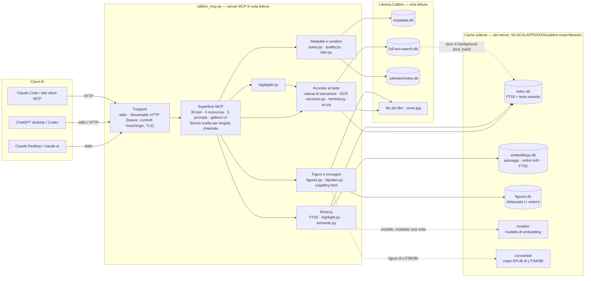
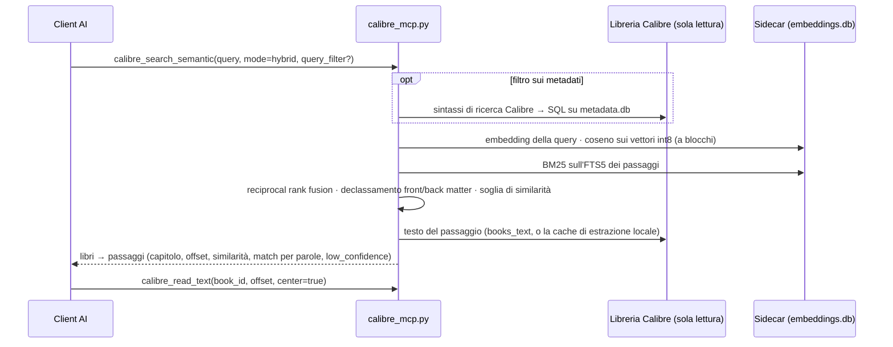

# Personalizzazione e funzionamento interno

[← README](../../README.it.md) · [Installazione](installation.md) · **Personalizzazione e funzionamento interno** · [Skill](skills.md) · [FAQ e risoluzione dei problemi](faq.md) · [Prestazioni](performance.md)

[🇬🇧 English](../en/tweaking.md) · 🇮🇹 Italiano

Come funziona dentro mcp-calibre, cosa fa in dettaglio ogni funzione e tutte le impostazioni che puoi cambiare.
Leggilo per capire un comportamento, per mettere a punto il server o per trovare il nome esatto di un tool, di una
variabile o di un flag da riga di comando. Sei nuovo? Parti dal [README](../../README.it.md); per installare vedi il
[manuale di installazione](installation.md). Le skill (distill, agente-libro, red-team) e il legal gate hanno il
loro manuale: [Skill](skills.md).

**Indice**

- **Come funziona**: [Architettura](#architettura) · [Design](#design) · [Perché un indice sidecar](#perché-un-indice-sidecar) · [Catena di estrazione del testo](#catena-di-estrazione-del-testo)
- **Le funzioni nel dettaglio**: [Tool](#tool) · [Curation della libreria](#curation-della-libreria) · [Leggere per capitoli](#leggere-per-capitoli) · [OCR per i PDF scansionati](#ocr-per-i-pdf-scansionati) · [Funzioni opzionali](#funzioni-opzionali) · [Modello per la ricerca semantica](#modello-per-la-ricerca-semantica) · [Mostrare le immagini nella chat](#mostrare-le-immagini-nella-chat)
- **Configurazione**: [Variabili d'ambiente](#variabili-dambiente) · [Riga di comando](#riga-di-comando) · [Console (gestione grafica)](#console-gestione-grafica)
- **Sicurezza e struttura**: [Note di sicurezza](#note-di-sicurezza) · [Struttura del repository](#struttura-del-repository)

## Architettura

### Componenti



Ogni freccia verso la libreria Calibre è una lettura attraverso una connessione SQLite aperta in `mode=ro` con
`PRAGMA query_only=1`, oppure la lettura di un file dentro la root della libreria. Il server scrive solo nella
propria cache sidecar.

### Moduli

| Modulo | Responsabilità |
|---|---|
| `calibre_mcp.py` | Punto di ingresso e CLI; trasporti stdio/HTTP; registrazione di tool, resources e prompts; registro delle librerie; la catena di estrazione del testo; l'indice full-text sidecar (`index.db`) e la sua sincronizzazione in background |
| `mcpcalibre/query.py` | Sintassi di ricerca di Calibre → SQL parametrico (logica booleana, esatto/regex, numeri, date, colonne custom, `vl:` e `search:`), con protezione ReDoS |
| `mcpcalibre/quality.py` | Audit dei metadati (controlli per libro e su tutta la libreria) |
| `mcpcalibre/isbn.py` | Validazione ISBN-10/13 e ricerca nel testo del libro |
| `mcpcalibre/structure.py` | Mappa dei capitoli: allineamento al TOC o rilevamento degli heading, classificazione front/back matter |
| `mcpcalibre/htmlmd.py` | HTML degli EPUB → Markdown (heading, liste, tabelle, codice, id delle figure) |
| `mcpcalibre/highlight.py` | Snippet guidati dalla query: clausole FTS5 (frasi, `NEAR`, `NOT`) cercate nel testo, finestre migliori prima |
| `mcpcalibre/semantic.py` | Backend di embedding, passaggi contestualizzati entro i capitoli, archivio vettori int8, ricerca ibrida con RRF |
| `mcpcalibre/figures.py` | Elenco ed estrazione delle figure di EPUB e PDF, rendering delle pagine, decodifica sicura delle immagini |
| `mcpcalibre/figindex.py` | Indice delle didascalie su tutta la libreria per la ricerca delle figure |
| `mcpcalibre/ocr.py` | OCR con Tesseract: scelta delle pagine e della lingua, download dei file di lingua |
| `mcpcalibre/legalgate.py` | Controlli di sovrapposizione, citazioni, compressione, titoli e attribuzione per gli appunti derivati |
| `mcpcalibre/ui/gallery.html` | Vista MCP Apps: galleria di immagini in linea con Copy/Save PNG |

### Archivi di dati

| Archivio | Dove | Chi lo scrive | Contenuto | Come si (ri)costruisce |
|---|---|---|---|---|
| `metadata.db` | libreria Calibre | solo Calibre | libri, autori, tag, serie, colonne custom, identifier, annotazioni, preferenze | — (sola lettura) |
| `full-text-search.db` | libreria Calibre | solo Calibre | testo estratto da Calibre da ogni formato | indicizzazione FT di Calibre |
| `.calnotes/notes.db` | libreria Calibre | solo Calibre | note su autori, tag, serie (Calibre 7+) | — (sola lettura) |
| `index.db` | sidecar | questo server | indice FTS5 del testo di Calibre, testo estratto on-demand, indice con stemming opzionale | automatico: sync in background all'avvio e ogni 10 minuti; `--sync` |
| `embeddings.db` | sidecar | questo server | passaggi (offset, capitolo, tipo), vettori int8, FTS5 dei passaggi | `--build-embeddings` (incrementale; `--rebuild`) |
| `figures.db` | sidecar | questo server | didascalie e testo alternativo delle figure, vettori opzionali delle didascalie | `--index-figures` (incrementale) |
| `models/` | radice del sidecar | questo server | cache del modello di embedding | `--download-model` (setup) |
| `tessdata/` | radice del sidecar | questo server | file di lingua di Tesseract | `install.ps1` / `--download-ocr-langs` |
| `converted/` | sidecar | questo server | copie EPUB di libri LIT/MOBI/AZW3, create per raggiungerne le figure | on-demand, in base al file |

Il sidecar si trova in `%LOCALAPPDATA%\calibre-mcp\<hash-libreria>\` (una cartella per libreria). Cancellarlo è
sempre sicuro: tutto quello che contiene si può ricostruire dalla libreria Calibre.

### Flusso di una richiesta: una domanda semantica



### Garanzie di sola lettura

| Letture | Scritture |
|---|---|
| database di Calibre tramite `mode=ro` + `PRAGMA query_only=1`; file dei libri e copertine dentro la root della libreria (path risolti e confinati) | solo la cache sidecar descritta sopra e il file di log |

Non ci sono tool di scrittura, nessuna shell e nessun accesso alla rete durante le query (il modello viene
scaricato una volta durante il setup). L'unico subprocess è `ebook-convert` di Calibre, eseguito senza shell, con
timeout e a priorità ridotta.

## Design

| Aspetto | Scelta |
|---|---|
| Accesso ai dati | SQLite diretto su `metadata.db` / `full-text-search.db` in `mode=ro`: nessun subprocess `calibredb`, query in millisecondi |
| GUI di Calibre aperta | supportata: le connessioni read-only non vanno mai in conflitto con i lock di Calibre |
| Full-text | indice FTS5 sidecar sul testo **già estratto da Calibre** (EPUB/PDF/MOBI/DOCX…) |
| Formati leggibili | testo FTS di Calibre, poi estrazione on-demand: EPUB (integrata), PDF (PyMuPDF/pypdf), tutto il resto via `ebook-convert` |
| Trasporti | stdio e Streamable HTTP (stateless, risposte JSON, bearer auth, protezione DNS rebinding, TLS opzionale) |
| Portabilità | Windows/macOS/Linux, rilevamento automatico della libreria |
| Log | stderr + `%LOCALAPPDATA%\calibre-mcp\calibre-mcp.log`, query registrate solo a livello DEBUG |
| Ricerca semantica | indice locale opt-in di passaggi contestualizzati entro i capitoli (vettori int8 + FTS5 dei passaggi), classifica ibrida con reciprocal rank fusion |
| Struttura | mappa dei capitoli per ogni formato (allineamento al TOC o rilevamento degli heading), front/back matter classificati |
| Immagini | copertine e figure decodificate in modo sicuro e mostrate in linea tramite una vista MCP Apps; i dati delle immagini non entrano mai nel contesto del modello |
| Curation | audit in sola lettura: report di qualità, duplicati e confronto, ricerca dell'ISBN |
| Appunti derivati | skill companion più un legal gate meccanico (sovrapposizione, citazioni, compressione, titoli, attribuzione) |

## Perché un indice sidecar

La tabella FTS5 di Calibre usa un tokenizer custom (`calibre`) implementato nell'estensione C di Calibre, quindi
SQLite standard non può eseguire `MATCH` su di essa. La tabella `books_text`, che contiene il testo in chiaro,
è invece leggibile. Il server quindi:

1. legge `books_text` in sola lettura;
2. mantiene un indice FTS5 (`unicode61 remove_diacritics 2`) in `%LOCALAPPDATA%\calibre-mcp\<hash-libreria>\index.db`;
3. lo sincronizza **in modo incrementale** tramite `text_hash` (thread in background all'avvio, poi ogni 10 minuti).

Con SQLite ≥ 3.43 (Python 3.12+ da python.org) l'indice è *contentless* (`contentless_delete=1`) e non duplica
il testo. Con SQLite più vecchio ricade su FTS5 standard (occupa circa quanto il testo).

Quanto è veloce, misurato su una libreria sintetica di 1.500 libri, è nel [manuale delle prestazioni](performance.md#risultati).

## Catena di estrazione del testo

Per ogni libro, in ordine:

1. testo FTS di Calibre (già estratto da Calibre, il più veloce);
2. cache locale;
3. estrazione on-demand:
   - EPUB: parser integrato, tollerante a container/OPF/spine/TOC rotti (i problemi diventano `warnings`);
   - PDF: PyMuPDF o pypdf, senza limite di pagine;
   - TXT: lettura diretta;
   - tutto il resto (LIT, MOBI, AZW3, RTF, DOC, ODT…): `ebook-convert` di Calibre;
4. OCR, per i PDF scansionati, solo nel comando batch `--extract-missing` (vedi [OCR per i PDF scansionati](#ocr-per-i-pdf-scansionati)).

Se un formato fallisce si passa al successivo. Il testo estratto viene messo in cache **e indicizzato**, quindi un
libro letto una volta diventa trovabile anche con `calibre_search_fulltext`. I PDF scansionati senza layer di
testo restituiscono un errore esplicito "OCR needed".

## Tool

Tutti i tool sono in sola lettura e accettano un argomento opzionale `library` quando sono configurate più librerie.

| Tool | Scopo |
|---|---|
| `calibre_search_books` | Ricerca sui metadati: filtri strutturati più la **sintassi di ricerca di Calibre** in `query`, `virtual_library`, ordinamento (title, author, added, published, modified, rating, series), paginazione |
| `calibre_search_fulltext` | Ricerca nel contenuto, BM25, insensibile agli accenti. Modalità `all`/`any`/`phrase`/`raw` (FTS5). `query_filter` / `virtual_library` restringono i candidati; `stemmed=true` trova le varianti delle parole. Gli snippet sono i passaggi che coprono le clausole più specifiche trovate (frasi, gruppi `NEAR`; i termini in `NOT` sono esclusi) e le elencano in `matched` |
| `calibre_search_semantic` | Ricerca di passaggi per significato (indice di embedding opt-in). Multilingue; `alt_queries` aggiunge parafrasi o traduzioni, fuse per passaggio |
| `calibre_get_book` | Metadati completi, colonne custom, progresso di lettura, note su autori/serie/tag, formati, testo disponibile |
| `calibre_read_text` | Finestra di testo per offset (opzionalmente centrata sull'offset di uno snippet) |
| `calibre_find_in_book` | Ricerca keyword-in-context dentro un singolo libro, paginata |
| `calibre_get_toc` | Indice EPUB (nav/NCX → indici di sezione) o outline PDF + numero di pagine |
| `calibre_read_section` | Un capitolo EPUB o un intervallo di pagine PDF; `output="markdown"` mantiene heading, liste, tabelle, codice; i segnaposto delle immagini riportano l'id della figura (`[image s3-2: alt]`) |
| `calibre_show_images` | **Mostra** copertine e figure all'utente in linea nella chat (galleria MCP Apps), con pulsanti Copy PNG / Save PNG; i dati delle immagini non entrano mai nel contesto del modello |
| `calibre_list_figures` | Figure di un libro come elenco testuale e leggero: id, didascalia o testo alternativo, capitolo o pagina, dimensioni. EPUB, PDF, e gli altri formati tramite una conversione EPUB in cache |
| `calibre_get_figure` | Una figura come immagine, ridimensionata; gli SVG vengono rasterizzati |
| `calibre_render_page` | Una pagina PDF, o una sua area, come immagine: per diagrammi vettoriali, tabelle, formule |
| `calibre_get_chapters` | Mappa dei capitoli per qualsiasi formato (LIT, MOBI, PDF senza outline inclusi): dal TOC del libro quando possibile, altrimenti dagli heading nel testo; ogni capitolo è corpo, front o back matter |
| `calibre_quality_report` | Audit dei metadati: campi mancanti, titoli che sono nomi di file, ISBN non validi, anomalie nei nomi degli autori, ordinamento autore non impostato, stesso autore o tag scritto in modi diversi, buchi nelle serie |
| `calibre_find_isbn` | Trova l'ISBN del libro nel suo stesso testo (prima la pagina del copyright), validato dal checksum, confrontato con quello salvato |
| `calibre_compare_books` | Confronto campo per campo di possibili duplicati, con il suggerimento di quale record tenere; segnala le traduzioni |
| `calibre_semantic_index_report` | Controllo dell'indice semantico: libri falliti (con l'errore), mancanti, non aggiornati, vuoti, sparsi, campionati, senza testo e orfani, più l'integrità del database; ciascuno con la sua correzione |
| `calibre_search_figures` | Trova figure in tutta la libreria per didascalia e testo alternativo (per parole, e per significato con il modello semantico) |
| `calibre_check_overlap` | Legal gate: verifica che appunti tratti dai libri non li riproducano (sovrapposizione testuale, citazioni, compressione, struttura dei capitoli, attribuzione) |
| `calibre_list_facets` | Autori/tag/serie/editori/lingue/formati con il numero di libri |
| `calibre_list_custom_columns` | Le tue `#colonne`: tipo, multiplicità, copertura, valori più frequenti |
| `calibre_list_virtual_libraries` | Virtual library e ricerche salvate con espressione e numero di libri |
| `calibre_reading_progress` | Ultime posizioni di lettura dal viewer di Calibre: in lettura / finiti |
| `calibre_get_annotations` | Highlight, note e bookmark del viewer di Calibre |
| `calibre_get_notes` | Note di Calibre 7+ su autori, tag, serie, editori |
| `calibre_get_cover` | Copertina come immagine, ridimensionata |
| `calibre_similar_books` | Libri simili: per metadati (i tag rari pesano di più), per contenuto (parole distintive del libro cercate nell'indice full-text, usato in automatico quando i metadati sono troppo scarni) o per embedding |
| `calibre_find_duplicates` | Probabili duplicati per titolo, titolo+autore o ISBN. Prudente di default: ignora note di edizione e parentesi senza numeri, mantiene sottotitoli e parti numerate, non raggruppa mai numeri diversi della stessa serie. `loose=true` ignora anche i sottotitoli |
| `calibre_list_libraries` | Librerie configurate |
| `calibre_library_status` | Diagnostica: copertura FTS, sidecar e indice stemmed, indice semantico, funzioni attive |

### Sintassi di ricerca di Calibre (`query`)

| Esempio | Significato |
|---|---|
| `kerberos` / `"lateral movement"` | Titolo, autori, tag, serie, editore, descrizione |
| `tag:security and not tag:malware` | Booleani `and` / `or` / `not`, parentesi, AND implicito |
| `author:"=Bruce Schneier"` · `title:"~^Practical"` | Corrispondenza esatta · espressione regolare |
| `rating:>=4` · `#pages:>500` | Confronti numerici (rating in stelle) |
| `pubdate:>2020` · `date:<2024-03` · `date:>30daysago` | Date: YYYY, YYYY-MM, YYYY-MM-DD, today, yesterday, thismonth, thisyear, Ndaysago |
| `formats:pdf` · `languages:ita` · `cover:false` · `size:>20M` | Formati, lingue, copertina, dimensione del file più grande |
| `identifiers:isbn:true` · `isbn:9781593272906` | Identifier |
| `#genre:"=netsec"` · `#course:sans` · `#pages:>300` | Colonne custom (text, enumeration, series, comments, int, float, rating, bool, datetime), lette a runtime da ogni libreria. Lookup name come in Calibre; funziona anche l'intestazione visibile (`#mustread` per "Must Read") |
| `#mustread:yes` · `:no` · `:true` · `:false` | Le colonne sì/no seguono esattamente Calibre. Default (tristate): `yes`/`checked` = Sì, `no`/`unchecked` = No, `true` = Sì o No (impostato), `false`/`empty`/`blank` = non impostato. Con l'impostazione a due stati di Calibre: `true`/`yes` = Sì, `false`/`no` = No o non impostato |
| `vl:"Unread security"` · `search:"Big books"` | Virtual library e ricerche salvate, espanse ricorsivamente con rilevamento dei cicli |

Non supportati: `template:`, `marked:`, `ondevice:`, colonne composite (calcolate). Tutti i valori sono passati
come parametri SQL. Le espressioni regolari hanno un limite di lunghezza e i pattern con quantificatori annidati
o backreference vengono rifiutati (il modulo `re` di Python non ha timeout).

### Resources e prompts

| Resource | Contenuto |
|---|---|
| `calibre-mcp://book/{id}` | Scheda del libro in Markdown: metadati, colonne custom, progresso, descrizione, indice |
| `calibre-mcp://book/{id}/section/{n}` | Un capitolo EPUB in Markdown |
| `calibre-mcp://book/{id}/highlights` | Highlight e note del viewer in Markdown |

Prompts: `summarize_book`, `research_topic`, `compare_books`, `export_highlights`, `reading_status`.
Le resources si riferiscono alla libreria predefinita. Lo schema è `calibre-mcp://`, non `calibre://`, che è
quello dei link desktop di Calibre.

## Curation della libreria

Tutti i tool di curation sono in sola lettura: segnalano, e tu correggi in Calibre. Nessuno richiede un indice.

### Report di qualità

`calibre_quality_report` controlla l'intera libreria, una query Calibre (`query: 'tag:security'`) o una virtual
library. Restituisce un riepilogo per controllo, l'elenco paginato dei problemi per libro e i problemi a livello
di libreria.

| Controllo | Cosa trova | Correzione tipica in Calibre |
|---|---|---|
| `missing_authors`, `missing_tags`, `missing_language`, `missing_publisher`, `missing_pubdate`, `missing_cover`, `missing_isbn`, `missing_description` | il campo è vuoto (o l'autore è "Unknown") | Modifica metadati, oppure Scarica metadati |
| `no_formats` | un record senza alcun file del libro | elimina il record o aggiungi il file |
| `raw_filename_title` | titoli come `795731065.pdf` o `BOOK_12_final` | Modifica metadati → titolo (oppure `calibre_find_isbn` + Scarica metadati) |
| `title_noise` | `(Italian Edition)`, `[ebook]`, spazi doppi o finali | Modifica metadati → titolo |
| `invalid_isbn` | un ISBN salvato con checksum o lunghezza sbagliati | correggi l'identifier (`calibre_find_isbn` trova quello giusto) |
| `author_name_anomaly` | `\|`, `;`, cifre, `Cognome, Nome` nel campo nome, tutto maiuscolo | Gestisci autori → rinomina |
| `author_sort_unsorted` | ordinamento autore uguale al nome (`Glenn Cooper` invece di `Cooper, Glenn`) | Gestisci autori → ricalcola l'ordinamento |
| `author_variants` | lo stesso autore scritto in modi diversi (`Cooper\| Glenn` e `Glenn Cooper`) | Gestisci autori → rinomina uno nell'altro (Calibre li unisce) |
| `tag_variants` | lo stesso tag scritto in modi diversi (`Science-Fiction`, `science fiction`) | Navigatore dei tag → rinomina (unisce) |
| `series_gaps` | numeri mancanti o duplicati in una serie | correggi l'indice di serie, o annota il volume mancante |

### Duplicati e confronto

`calibre_find_duplicates` raggruppa i probabili duplicati per titolo, titolo + autore o ISBN. È prudente di
default: ignora note di edizione e parentesi senza numeri, ma mantiene sottotitoli e parti numerate, e non
raggruppa mai numeri diversi della stessa serie. I gruppi con libri in lingue diverse sono segnalati come
**probabili traduzioni**. `calibre_compare_books` confronta poi un gruppo campo per campo (formati, identifier,
descrizione, copertina, testo estratto…) e suggerisce quale record tenere.

### ISBN dal testo

`calibre_find_isbn` analizza il testo del libro (prima la pagina del copyright; gli ISBN citati nel corpo hanno
priorità più bassa), tiene solo gli ISBN con checksum valido e confronta il migliore con l'identifier salvato:
confermato, diverso o suggerito. Utile per i libri con metadati scarni prima di "Scarica metadati".

## Leggere per capitoli

`calibre_get_chapters` restituisce una mappa dei capitoli per **ogni** formato:

| Metodo | Quando | Come |
|---|---|---|
| `toc` | EPUB con TOC, PDF con outline | le voci del TOC del libro vengono cercate nel testo, in ordine (numerazioni come "1." o "Capitolo 3" vengono ignorate da entrambe le parti) |
| `headings` | LIT, MOBI, AZW3, DOCX, PDF senza outline, EPUB senza TOC | gli heading vengono rilevati nel testo (parole chiave di capitolo/parte in più lingue, numerazione, numeri romani, righe brevi in maiuscolo); un indice stampato nel testo viene riconosciuto e saltato |
| `none` | nessuna struttura trovata | un solo capitolo che copre tutto il testo |

Ogni capitolo è classificato come `body`, `front` (indice, copyright, pagine di lodi, dedica…) o `back` (indice
analitico, bibliografia, note…), in base al titolo e, per i titoli ambigui come i ringraziamenti, alla posizione.
`calibre_read_text(book_id, chapter=N)` legge un capitolo e si ferma alla sua fine. La stessa mappa guida i
passaggi semantici (non attraversano mai un capitolo), il declassamento del front matter e il controllo dei
titoli del legal gate. `calibre_get_toc` / `calibre_read_section` restano disponibili per le sezioni EPUB e gli
intervalli di pagine PDF.

## OCR per i PDF scansionati

I PDF scansionati non hanno un livello di testo, quindi Calibre non li indicizza e restano invisibili alle
ricerche. Con un motore OCR installato, `--extract-missing` li riconosce **in automatico**: vengono elaborate solo
le pagine senza testo (quelle con un livello di testo restano com'erano) e il risultato va nella cache del server
come qualsiasi altra estrazione. Il PDF non viene mai modificato. Da lì funzionano anche su quei libri la ricerca
full-text, i capitoli e (dopo `--build-embeddings`) la ricerca semantica.

```powershell
.\install.ps1                                                       # configura l'OCR di default: Tesseract (winget) + ita/eng
.venv\Scripts\python.exe calibre_mcp.py --extract-missing            # OCR dei PDF scansionati, ricorda i fallimenti
.venv\Scripts\python.exe calibre_mcp.py --build-embeddings           # aggiunge i nuovi testi alla ricerca semantica
```

| Motore (`CALIBRE_MCP_OCR_ENGINE`) | Velocità su CPU | Fedeltà | Note |
|---|---|---|---|
| `tesseract` (default se installato) | ~1–3 s per pagina | alta: trascrive, non inventa mai | lingua dalla lingua del libro in Calibre, altrimenti `ita+eng`; file di lingua scaricati da `install.ps1` in `%LOCALAPPDATA%\calibre-mcp\tessdata` |
| `none` | — | — | OCR disattivato |

**PDF con un livello di testo sbagliato** (un vecchio OCR illeggibile) sembrano indicizzati ma contengono testo
privo di senso. Rifai l'OCR in modo esplicito; il nuovo testo prende poi il posto di quello di Calibre per la
lettura, la ricerca full-text e quella semantica:

```powershell
.venv\Scripts\python.exe calibre_mcp.py --extract-missing --books 812,977 --force-ocr
```

L'OCR gira solo in questo comando batch, mai dentro una richiesta in chat (un libro intero richiede minuti). I
libri che falliscono vengono ricordati e saltati finché uno dei loro file non cambia; `--retry-failed` li
riprova. Il report dell'indice semantico mostra il loro errore sotto `no_text`.

## Funzioni opzionali

**Più librerie.** Imposta `CALIBRE_LIBRARIES` con i path separati da `;` su Windows (`:` altrove); la prima è
quella predefinita. Ogni libreria ha il proprio indice sidecar.

**Ricerca con stemming.** `CALIBRE_MCP_STEMMING=1` costruisce un secondo indice FTS5 con lo stemmer Porter
(`exploits` ↔ `exploitation`). Raddoppia circa lo spazio dell'indice e viene riempito in modo incrementale in
background. Porter è uno stemmer **inglese**: non aiuta con il testo italiano.

**Ricerca semantica.** Dipendenze e modello vengono installati da `install.ps1` (escludibili con `-NoSemantic`):
vedi [Modello per la ricerca semantica](#modello-per-la-ricerca-semantica). L'indice è opt-in e mai costruito in
automatico:

```powershell
.venv\Scripts\python.exe calibre_mcp.py --build-embeddings --max-books 50   # incrementale, riprendibile
```

Come viene costruito l'indice: ogni libro è diviso in passaggi di circa 700 caratteri che non attraversano mai il
confine di un capitolo (mappa dei capitoli), e ogni passaggio è codificato insieme al suo contesto (titolo, autore
e capitolo), così il vettore sa da dove proviene. Il libro è coperto per intero, fino a 1.500 passaggi
(`CALIBRE_MCP_EMBED_MAX_CHUNKS`), salvati come vettori int8 più un indice per parole sugli stessi passaggi.

Come viene risposta una query (`mode`): **hybrid** (default) ordina i passaggi per significato e per termini esatti
(nomi, id, codice) e fonde le due classifiche con la reciprocal rank fusion; `vector` e `keyword` usano solo una
metà. Front e back matter (indice, pagine di lodi, indice analitico) vengono declassati ed etichettati; i risultati
sotto la soglia di similarità (`CALIBRE_MCP_SEMANTIC_FLOOR`, default 0,30, non ancora calibrata su librerie grandi)
sono marcati `low_confidence`. Con `book_id` la ricerca restituisce passaggi ordinati dentro un solo libro.

Dimensioni: circa 700 passaggi per un libro medio, circa 384 byte ciascuno in memoria. Per circa 1.000 libri
aspettati circa 300 MB di RAM per i vettori, un indice di circa 600 MB su disco e una prima costruzione di una o due
ore di CPU (metà dei core di default, `CALIBRE_MCP_EMBED_THREADS`); le costruzioni successive elaborano solo i libri
nuovi o modificati.

**Aggiornamento dalla 4.x:** il formato dell'indice è cambiato. Esegui una volta `--build-embeddings`: rileva il
vecchio indice e lo ricostruisce; fino ad allora la ricerca semantica lo segnala invece di dare risultati vecchi.

**Controllare e riparare l'indice semantico.** Una costruzione non si ferma mai su un libro problematico: il
libro viene saltato e il suo errore registrato. Per vedere cosa contiene l'indice e cosa è andato storto:

```powershell
.venv\Scripts\python.exe calibre_mcp.py --embeddings-report          # leggibile; --json per gli script
```

(oppure chiedilo all'assistente: usa `calibre_semantic_index_report`). Il report confronta l'indice con la
libreria attuale e raggruppa i libri per problema, ciascuno con la sua correzione:

| Categoria | Significato | Cosa fare |
|---|---|---|
| `failed` | embedding fallito; l'errore viene mostrato (es. un formato eliminato in Calibre, un file danneggiato) | correggi la causa in Calibre, poi `--build-embeddings --retry-failed` |
| `missing` | il libro ha testo ma non è ancora indicizzato | `--build-embeddings` (o `--books <id>`) |
| `stale` | il testo del libro è cambiato dopo l'indicizzazione | `--build-embeddings` lo aggiorna |
| `empty` | indicizzato con zero passaggi: quasi nessun testo reale (solo immagini, copertine) | controlla con `calibre_read_text` |
| `sparse` | molti meno passaggi di quanto suggerisce la lunghezza del testo: il testo estratto è probabilmente danneggiato (rumore di impaginazione, codifica errata) | controlla con `calibre_read_text`, correggi o converti il formato in Calibre, poi `--books <id>` |
| `capped` | libro molto lungo, campionato a `CALIBRE_MCP_EMBED_MAX_CHUNKS` passaggi | alza il limite e rilancia `--books <id>` |
| `no_text` | nessun testo estratto | lascia indicizzare Calibre, o `--extract-missing`, poi costruisci |
| `orphan` | eliminato da Calibre ma ancora nell'indice | rimosso dalla prossima `--build-embeddings` completa |

Controlla anche il database stesso (integrità SQLite, numero di passaggi per libro, dimensione dei vettori). Per
ogni categoria stampa il comando esatto per rielaborare solo quei libri, per esempio:

```powershell
.venv\Scripts\python.exe calibre_mcp.py --build-embeddings --books 81,82,89   # solo questi, forzati
.venv\Scripts\python.exe calibre_mcp.py --build-embeddings --retry-failed     # solo quelli falliti
```

Un'esecuzione mirata non rimuove né ricalcola mai gli altri libri.

Per gli aggiornamenti periodici, `scripts\update_embeddings.bat` esegue i quattro passi in ordine (testi mancanti con OCR, costruzione
semantica incrementale, indice delle figure, report) e salva il report in `%LOCALAPPDATA%\calibre-mcp\embeddings-report.txt`.
Le opzioni vengono passate alla costruzione: `scripts\update_embeddings.bat --retry-failed`,
`scripts\update_embeddings.bat --books 81,82`; `/?` mostra l'aiuto.

**Ricerca delle figure.** `calibre_mcp.py --index-figures` indicizza didascalie e testo alternativo delle figure
di EPUB e PDF (incrementale; con il modello semantico le didascalie vengono anche codificate). Poi
`calibre_search_figures` le trova in tutta la libreria e `calibre_show_images` le mostra.

**Figure.** Prima `calibre_list_figures` (solo testo, costa poco), poi `calibre_get_figure` per quella che serve.
Nei PDF, una didascalia senza immagine incorporata indica un disegno vettoriale: `calibre_render_page` con un
`clip` attorno. Ogni immagine consuma token di visione, quindi niente viene inviato in blocco.

**Lingue.** La ricerca full-text è lessicale: la query deve essere nella lingua dei libri (una query in italiano
non trova testo inglese). Le instructions del server dicono al modello di tradurre la query, o di mettere in OR
le traduzioni per le librerie miste. La ricerca semantica è multilingue (una domanda in italiano trova anche
passaggi in inglese); il modello può passare la traduzione inglese in `alt_queries` per aumentare il recall. Lo
stemming è solo inglese, e tradurre la query non cambia nulla per i libri in italiano.

**Markdown per le pagine PDF.** `pip install pymupdf4llm` (AGPL-3.0). Il Markdown per gli EPUB è integrato.

## Modello per la ricerca semantica

La ricerca semantica usa **`sentence-transformers/paraphrase-multilingual-MiniLM-L12-v2`**, un modello di
sentence embedding addestrato a collocare frasi in **oltre 50 lingue, italiano incluso, nello stesso spazio
vettoriale**: una domanda in italiano e un passaggio in inglese che dicono la stessa cosa finiscono vicini. Puoi
quindi chiedere in italiano e trovare passaggi in libri inglesi, o il contrario, senza alcuna traduzione. (La
ricerca full-text lessicale è diversa: lì la query deve essere nella lingua dei libri, vedi
[Funzioni opzionali](#funzioni-opzionali).)

| | |
|---|---|
| Dimensione | circa 220 MB, vettori a 384 dimensioni |
| Esecuzione | ONNX su CPU tramite `fastembed`: nessuna GPU, nessun servizio esterno |
| Dove risiede | `%LOCALAPPDATA%\calibre-mcp\models` (modificabile con `FASTEMBED_CACHE_PATH`), non nella cartella temporanea, così la pulizia disco non lo cancella |
| Quando viene scaricato | **Una sola volta, da Python, durante il setup**: `install.ps1` esegue `calibre_mcp.py --download-model` subito dopo aver installato le dipendenze semantiche |
| Rete dopo il setup | Nessuna: costruzione dell'indice e ogni query semantica girano interamente su questa macchina; testo dei libri e domande non escono mai |

Se il download fallisce durante il setup (proxy, firewall), il resto dell'installazione non ne risente. Imposta
`HTTPS_PROXY` e riprova:

```powershell
.venv\Scripts\python.exe calibre_mcp.py --download-model
```

Senza accesso a internet, copia la cartella del modello da un'altra macchina nella directory di cache indicata
sopra, oppure usa `CALIBRE_MCP_EMBED_BACKEND=hash` (fallback lessicale offline, non semantico). Un altro modello
`fastembed` si sceglie con `CALIBRE_MCP_EMBED_MODEL`; l'indice è legato al modello, quindi cambiarlo richiede
`--build-embeddings --rebuild`.

## Mostrare le immagini nella chat

Le immagini restituite da un normale tool MCP arrivano al modello, ma la maggior parte dei client le mostra
solo dentro il blocco ripiegato della chiamata al tool, e il modello non può riusarle nei file.
`calibre_show_images` mostra copertine e figure **all'utente, in linea nella conversazione**, usando
l'estensione ufficiale MCP Apps (SEP-1865):

- il tool dichiara un'interfaccia (`_meta.ui.resourceUri = ui://calibre-mcp/gallery`), una galleria HTML
  autonoma che il client visualizza in un riquadro isolato (sandbox) dentro la chat;
- le immagini viaggiano in `structuredContent`, che va alla galleria e **non nel contesto del modello**:
  mostrare immagini non costa token, e il modello riceve solo un breve riepilogo testuale;
- tutto resta in sola lettura: nessun file viene scritto, la galleria non ha accesso alla rete (le immagini
  sono URI `data:`, ammessi dalla CSP restrittiva predefinita della specifica) e nulla esce dalla macchina.

Esempio di richiesta all'assistente: "mostrami le copertine di 1168 e 1164", oppure "mostrami la figura s3-2
di 1164".

**Copiare e salvare.** Ogni immagine ha due pulsanti, che producono entrambi un vero PNG (le sorgenti JPEG
vengono convertite nel browser), mentre il server continua a non scrivere nulla:

| Pulsante | Come | Dipende dal client |
|---|---|---|
| Copy PNG | Clipboard API (`image/png`); la galleria dichiara il permesso `clipboardWrite` della specifica | Se il client nega l'accesso agli appunti, ripiega sulla copia dell'immagine come selezione, che Word, PowerPoint, Outlook e la maggior parte degli editor incollano come immagine |
| Save PNG | Chiede al client di salvare il file (`ui/download-file`), quindi il download passa dal flusso del client | I client senza quella richiesta usano il download nativo del riquadro; se anche i download sono bloccati, la riga di stato lo segnala |

Anche trascinare un'immagine fuori dalla galleria verso un'altra applicazione funziona nella maggior parte dei client.

**Supporto dei client.** MCP Apps è supportato, tra gli altri, da Claude (web e desktop) e ChatGPT. Un client
senza supporto mostra solo il riepilogo: il riepilogo indica al modello di riprovare con
`also_for_model=true`, che allega anche piccole miniature per il modello (dentro il blocco del tool, con costo
in token immagine) così può descriverle. Sono stati segnalati problemi di visualizzazione su alcune build di
Claude Desktop per Windows; il fallback copre anche quel caso.

**Sicurezza della vista.** Didascalie e titoli provengono dai libri, quindi vengono inseriti come testo, mai
come HTML; vengono visualizzati solo dati PNG e JPEG (SVG e qualunque altro formato vengono scartati); la
galleria accetta messaggi solo dal riquadro padre e non carica nulla dall'esterno. Queste proprietà sono
verificate in un browser reale (`tests/test_gallery_browser.py`, `tests/test_gallery_copy_save.py`), con didascalie e payload ostili.

## Variabili d'ambiente

| Variabile | Default |
|---|---|
| `CALIBRE_LIBRARY` | rilevata da `%APPDATA%\calibre\global.py.json`, poi `~\Calibre Library` |
| `CALIBRE_MCP_DATA` | `%LOCALAPPDATA%\calibre-mcp` |
| `CALIBRE_MCP_MAX_CHARS` | `12000` (limite per singola lettura: controlla il consumo di token) |
| `CALIBRE_MCP_SYNC_INTERVAL` | `600` s (`0` = solo all'avvio) |
| `CALIBRE_MCP_THROTTLE_MS` | `5` ms di pausa per documento indicizzato |
| `CALIBRE_EBOOK_CONVERT` | rilevato: PATH, poi `Calibre2\ebook-convert.exe` sia in `Program Files` sia in `Program Files (x86)` (anche da processi a 32 bit, via `%ProgramW6432%`) |
| `CALIBRE_MCP_CONVERT_TIMEOUT` | `180` s per conversione |
| `CALIBRE_MCP_OCR_ENGINE` | `auto` (Tesseract se installato) · `tesseract` · `none` |
| `CALIBRE_MCP_OCR_LANGS` | `ita+eng` (ripiego se il libro non ha lingua) |
| `CALIBRE_MCP_TESSERACT` / `CALIBRE_MCP_TESSDATA` | rilevati in automatico: percorso di Tesseract, file di lingua |
| `CALIBRE_MCP_OCR_DPI` / `CALIBRE_MCP_OCR_PAGE_TIMEOUT` | `300` / `180` s |
| `CALIBRE_MCP_LOG_LEVEL` | `INFO` (`DEBUG` registra anche le query) |
| `CALIBRE_MCP_HTTP_TOKEN` | — (obbligatorio per `--transport http`, min 24 caratteri) |
| `CALIBRE_LIBRARIES` | — più librerie, separate da `;` su Windows; la prima è la predefinita |
| `CALIBRE_MCP_STEMMING` | `0` (`1` = secondo indice con stemming) |
| `CALIBRE_MCP_EMBED_BACKEND` | `fastembed` (`hash` = fallback lessicale per test o macchine air-gapped) |
| `CALIBRE_MCP_EMBED_MODEL` | `sentence-transformers/paraphrase-multilingual-MiniLM-L12-v2` |
| `CALIBRE_MCP_EMBED_MAX_CHUNKS` | `1500` passaggi per libro (campionati uniformemente oltre) |
| `CALIBRE_MCP_EMBED_CHUNK` | `700` caratteri per passaggio |
| `CALIBRE_MCP_SEMANTIC_FLOOR` | `0.30` similarità sotto cui i risultati sono marcati `low_confidence` |
| `CALIBRE_MCP_EMBED_THREADS` | metà dei core |
| `FASTEMBED_CACHE_PATH` | `%LOCALAPPDATA%\calibre-mcp\models` |
| `CALIBRE_CONFIG_DIRECTORY` | variabile propria di Calibre (installazioni portabili): dove il server cerca il `global.py.json` di Calibre quando rileva la libreria. Default: `%APPDATA%\calibre` |
| `HTTPS_PROXY` | — (proxy usato dai download una tantum: modello di embedding e file di lingua dell'OCR) |

## Riga di comando

`python calibre_mcp.py [flag]`. Senza un flag di azione il server si avvia (stdio, salvo `--transport http`); un flag di
azione svolge il suo compito ed esce. Eseguilo con l'interprete del progetto (`.venv\Scripts\python.exe`).

**Azioni**

| Flag | Cosa fa |
|---|---|
| `--status` | stampa il report di stato (JSON) ed esce |
| `--sync` | costruisce o aggiorna l'indice full-text sidecar ed esce (senza pausa per documento) |
| `--extract-missing` | estrae e indicizza il testo dei libri che Calibre non ha ancora indicizzato, a bassa priorità; i PDF scansionati vengono sottoposti a OCR salvo `--no-ocr` |
| `--build-embeddings` | costruisce o aggiorna l'indice semantico opzionale (pesante per la CPU, incrementale, riprendibile) |
| `--embeddings-report` | controlla l'indice semantico: libri falliti, mancanti, obsoleti, vuoti, scarni, troncati, senza testo e orfani, più l'integrità del database |
| `--index-figures` | costruisce o aggiorna l'indice delle didascalie delle figure usato da `calibre_search_figures` |
| `--download-model` | scarica il modello semantico nella cache locale (un passo di installazione) |
| `--download-ocr-langs LINGUE` | scarica i file di lingua di Tesseract, per esempio `ita,eng` (un passo di installazione) |
| `--legal-gate DIR --book ID` | controlla una cartella di skill o appunti rispetto ai libri fonte (`--book` è ripetibile); codice di uscita 0 = superato, 1 = fallito |
| `--gen-token` | stampa un bearer token casuale ed esce |

**Modificatori**

| Flag | Si applica a | Significato |
|---|---|---|
| `--library PERCORSO` | tutto | la cartella della libreria Calibre (ha la precedenza su `CALIBRE_LIBRARY`) |
| `--max-books N` | `--extract-missing`, `--build-embeddings`, `--index-figures` | elabora al massimo N libri in questa esecuzione |
| `--books IDS` | `--extract-missing`, `--build-embeddings` | solo questi id di libri, separati da virgola |
| `--retry-failed` | `--extract-missing`, `--build-embeddings` | riprova i libri che erano falliti |
| `--rebuild` | `--build-embeddings` | scarta l'indice semantico e lo ricostruisce (necessario dopo aver cambiato modello) |
| `--no-ocr` | `--extract-missing` | non esegue l'OCR dei PDF scansionati |
| `--force-ocr` | `--extract-missing --books` | esegue l'OCR di questi PDF anche se hanno un livello di testo (difettoso) |
| `--json` | `--embeddings-report` | output leggibile da macchina |

**Opzioni del server**

| Flag | Significato |
|---|---|
| `--transport stdio\|http` | `stdio` (default, avviato dal client) oppure `http` Streamable |
| `--host`, `--port`, `--path` | indirizzo di bind HTTP (default `127.0.0.1`), porta (`8765`) ed endpoint (`/mcp`) |
| `--allowed-host`, `--allowed-origin` | liste di host e di Origin del browser consentiti |
| `--ssl-certfile`, `--ssl-keyfile` | TLS nativo |
| `--no-auth` | disattiva l'autenticazione bearer (solo loopback) |

Le opzioni HTTP, con i loro default e le loro regole, sono descritte in [Trasporto HTTP](installation.md#trasporto-http).

## Console (gestione grafica)

La console è un programma separato e opzionale in `gui/`: un gestore desktop che avvia e supervisiona il server e i
lavori di manutenzione e tiene le tue impostazioni in un posto solo. Avviala con `console.bat` nella radice del
repository. Non modifica il server: tutto ciò che fa si può fare a mano con le [variabili d'ambiente](#variabili-dambiente) e
la [riga di comando](#riga-di-comando). La procedura guidata e la console sono in inglese.

*Start server* della console serve solo per l'**HTTP**: con stdio il client AI avvia il server da solo (vedi le
[FAQ](faq.md#le-basi)).

Usa il `.venv` del progetto se presente, altrimenti il Python della macchina; nessun pacchetto aggiuntivo.

- **Profili al posto delle righe `set`.** Ogni variabile di [Variabili d'ambiente](#variabili-dambiente) è un
  campo, raggruppato per argomento; un campo vuoto significa default del server e vengono esportati solo i valori
  non vuoti. Di default la console rimuove prima dall'ambiente ereditato le variabili che gestisce, così un
  vecchio `set` nella shell genitore non può infiltrarsi. *Importa dall'ambiente* cattura le variabili della shell
  da cui è stata avviata la console. La scheda **Transport** mostra la riga di comando risolta e può copiarla come
  script `.bat` o PowerShell, senza mai includere il token.
- **Output classificato.** Ogni riga scritta dal server o da un lavoro è etichettata *error*, *warning*, *status*,
  *progress*, *request* o *debug*. I traceback restano uniti, l'avanzamento in stile `\r` (pip, barre di download)
  aggiorna una sola riga e muove la barra di progresso, e le righe di accesso HTTP sono divise per codice di stato
  (4xx warning, 5xx error). Filtri per tipo, sorgente e testo; un pannello **Problems** elenca solo errori e
  avvisi.
- **Lavori di manutenzione.** `--status` (mostrato come albero nella scheda Overview), `--sync`,
  `--extract-missing` (con `--books`, `--retry-failed`, `--no-ocr`, `--force-ocr`), `--build-embeddings`,
  `--index-figures`, `--embeddings-report`, `--download-model`, `--download-ocr-langs` e una sequenza di
  aggiornamento nello stesso ordine di `scripts\update_embeddings.bat`. Un lavoro alla volta, annullabile.
- **Integrazione con Claude.** Scrive la voce di Claude Desktop (prima un backup con data e ora), copia il comando
  per Claude Code o il JSON per `mcp-remote`, e può seguire nella console il log `mcp-server-<nome>.log` di Claude
  Desktop.

**Trasporto.** La supervisione funziona in **HTTP**: la console avvia `calibre_mcp.py --transport http`, lo
interroga (`initialize` e `tools/list`) e mostra stato, uptime e numero di richieste. In modalità **stdio**
l'output standard del processo figlio è il canale del protocollo e Claude Desktop possiede il processo, quindi la
console non può supervisionarlo; offre invece un self-test del protocollo (con la verifica che stdout contenga solo
JSON-RPC) e la lettura in tempo reale del log di Desktop.

**Sicurezza.** Il bearer token è casuale a 256 bit e viene salvato con DPAPI di Windows (solo per l'utente
corrente) in `%LOCALAPPDATA%\calibre-mcp-console\profiles.json`; non viene mai scritto in chiaro. *Copia comando
Claude Code* e *Copia JSON mcp-remote* mettono invece il token reale negli appunti. Prima dell'avvio la console
blocca token mancante o troppo corto, `--no-auth` fuori dal loopback e bind non loopback senza allow-list, e
segnala un bind non loopback senza TLS. La verifica TLS nel self-test si può disattivare solo per host loopback.

Test unitari del classificatore di output: `python tests/test_console_logic.py`.

## Note di sicurezza

- **HTTP**: bind su loopback di default; bearer token statico confrontato in tempo costante (min 24 caratteri, `--gen-token` = 256 bit); validazione di Host/Origin contro il DNS rebinding; nessun header `Server`; `--no-auth` rifiutato fuori da loopback. Il token dà accesso in lettura all'intera libreria: trattalo come una password. Senza TLS, token e contenuto dei libri viaggiano in chiaro sulla rete.
- **Read-only by design**: connessioni SQLite in `mode=ro` con `PRAGMA query_only`; nessun tool di scrittura, nessuna shell. L'unico subprocess è `ebook-convert` (argv a lista, senza shell, timeout, stdout catturato, priorità below-normal, directory di output temporanea).
- **Confinamento dei path**: i path derivati dal DB vengono risolti e rifiutati se escono dalla root della libreria.
- **Query FTS**: in `all`/`any`/`phrase` ogni token è quotato, quindi gli operatori FTS5 nell'input non possono cambiare la semantica della query; `raw` è opt-in e gli errori di sintassi sono gestiti.
- **Parsing di contenuto non fidato**: gli EPUB hanno limiti di dimensione per membro e totali (anti zip-bomb) e confinamento dei path nell'archivio; l'XML passa da `defusedxml`; i PDF vengono analizzati solo on-demand. PyMuPDF e i convertitori di Calibre sono codice nativo (superficie d'attacco memory-safety): se il rischio non è accettabile, usa `-Pdf pypdf` o `none`, lascia `ebook-convert` non disponibile e affidati all'indicizzazione di Calibre.
- **Prompt injection indiretta**: testo dei libri e annotazioni sono contenuto di terzi restituito al modello. Le `instructions` del server lo dichiarano esplicitamente, ma non è un controllo forte: evita di combinare questo server, nella stessa sessione, con tool ad alto impatto (invio mail, shell, browser).
- **Immagini**: decodificate da file non fidati con un limite di pixel verificato dall'header prima della decodifica (decompression bomb), limiti di dimensione e confinamento dei path nell'archivio; gli SVG vengono solo rasterizzati, mai passati come markup; l'output è sempre ricodificato. Anche il testo dentro le immagini è contenuto non fidato (prompt injection visiva): le instructions del server lo dichiarano.
- **Linguaggio di query**: compilato in SQL parametrico; nomi di tabelle e colonne arrivano solo da una mappa fissa o dagli id interi delle colonne custom, mai dal testo dell'utente. Protezione ReDoS sulle regex (limite di lunghezza, niente quantificatori annidati o backreference, testo analizzato troncato).
- **Ricerca semantica**: il modello di embedding è codice e pesi di terze parti scaricati una volta da Hugging Face durante il setup (fiducia nella supply chain); le query non lasciano mai la macchina. Usa `CALIBRE_MCP_EMBED_BACKEND=hash` dove i download non sono accettabili.
- **Curation e legal gate**: solo report; nulla viene modificato in Calibre. Il legal gate è una prova meccanica di trasformazione, non un parere legale.
- **OCR**: Tesseract gira come subprocess con argomenti a lista, senza shell, con timeout per pagina e priorità ridotta; il rendering delle pagine ha un limite di pixel. L'output dell'OCR è contenuto non fidato come qualsiasi testo dei libri.
- **Nessun percorso di scrittura**: il server non modifica mai la libreria Calibre. Scrive solo i propri file sidecar in `%LOCALAPPDATA%\calibre-mcp`.
- **Licenze**: PyMuPDF e pymupdf4llm sono AGPL-3.0; pypdf è BSD; fastembed è Apache-2.0.

## Struttura del repository

La radice contiene solo ciò che si esegue direttamente o a cui punta la configurazione di un client (`calibre_mcp.py`,
`install.ps1`, i due launcher), più i metadati del progetto. Tutto il resto sta in una cartella.

| Percorso | Contenuto |
|---|---|
| `calibre_mcp.py` | Punto d'ingresso del server; Claude Desktop e gli altri client puntano qui, quindi non si sposta |
| `mcpcalibre/` | Moduli del server (`semantic`, `figindex`, `ocr`, `legalgate`, …); `mcpcalibre/ui` è la galleria di immagini mostrata nella chat, non la console desktop |
| `install.ps1`, `requirements*.txt` | Installer ed elenchi delle dipendenze |
| `setup-wizard.bat`, `console.bat` | Launcher degli strumenti grafici |
| `gui/` | Procedura guidata (`setup-wizard.ps1`), console (`calibre_mcp_console.py`) e relative note per sviluppatori |
| `docs/` | I manuali, in inglese (`docs/en/`) e in italiano (`docs/it/`) |
| `scripts/` | `update_embeddings.bat` (aggiornamento periodico degli indici). Qui stanno anche gli strumenti locali di pubblicazione, ignorati da git, `publish_me.bat` e `publish-to-github.ps1` |
| `presentation/` | Figura dell'architettura (`Architecture_and_Technical_Overview.png`, usata dai README), `icon/` (il gufo: SVG, PNG in più dimensioni, favicon, anteprima social di GitHub e lo script che li rigenera), `screenshots/` (le immagini della procedura guidata e della console usate dai README), e due documenti PDF: una guida utente (`mcp-calibre userguide.pdf`) e un manuale di architettura e funzionalità (`mcp-calibre_architecture.pdf`) |
| `skills/` | Skill companion (`calibre-distill`, `calibre-distill-topic`, `calibre-book-agent`, `calibre-book-redteam`) |
| `tests/` | Suite di test (compreso `test_skills.py`, che verifica le skill rispetto al server), generatore della libreria finta e benchmark sintetico delle prestazioni (`bench_synthetic.py`) |
| `.github/` | Workflow di CI |
